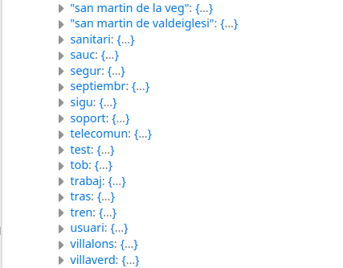

# lunr_manual
Manual con ejemplo de cómo usar la librería lunr.js

# <span class="c11 c53">Manual de LUNR</span>

<span class="c2">Javier Portal Martínez</span>

<span class="c2">Versión: 1.0</span>

<span class="c2"></span>

* * *

<span class="c2"></span>

## <span class="c11 c56">Introducción</span>

<span class="c2">En este documento vamos a tratar de implementar un buscador usando la librería lunr.js que es un motor de búsqueda construido totalmente en javascript y que por tanto funciona sólo en la capa cliente sin necesitad de un servidor ni conexión tras la carga de la página.</span>

<span class="c2">Todo el código está implementado con la versión 2.3.8 de la librería.</span>

<span class="c2">Lunr implementa algunas de las funcionalidades de Solr, uno de los motores de búsqueda más utilizado del lado del servidor.</span>

<span class="c2">El funcionamiento básico de esta librería consiste en parsear los textos de un conjunto de documentos que le debemos proporcionar en formato JSON con los que crea un índice inverso que proporciona búsquedas muy rápidas. También proporciona mecanismos para modificar la relevancia de campos y documentos tanto en tiempo de indexación como de consulta.</span>

<span class="c2">Se denomina documento en este contexto a cada uno de los objetos estructurados con atributos de tipo texto que añadimos al índice de Lunr. Un documento habitualmente puede estar estructurado en los siguientes atributos: ref o ID, título, cuerpo, enlace, etc.</span>

<span class="c2">Este tipo de motores de búsqueda suelen implementar algunas o todas de las siguientes funcionalidades:</span>

*   <span class="c2">Búsqueda muy rápida por texto libre y por varios campos simultaneamente.</span>
*   <span class="c2">Buena ponderación de los documentos más similares a la búsqueda.</span>
*   <span class="c2">Búsquedas neutrales con respecto a mayúsculas, minúsculas, tildes, etc.</span>
*   <span class="c2">Stemming. Cálculo de las raíces de los textos según el idioma que permite encontrar palabras derivadas de las palabras buscadas.</span>
*   <span class="c2">Stop words. Posibilidad de eliminar las palabras que no contienen semántica.</span>
*   <span class="c2">Búsquedas difusas. Posibilidad de encontrar resultados aproximados aunque se hayan introducidos palabras en la búsqueda con errores ortográficos.</span>

<span class="c2"></span>

<span class="c2"></span>

<span class="c2"></span>

* * *

## <span class="c11 c56"></span>

## <span class="c11 c56">Un ejemplo básico</span>

<span class="c2">Vamos a partir de un excel como origen de datos, transformarlo en JSON e implementar un ejemplo básica de página de búsqueda libre y un filtro que nos permita filtrar por municipios de la Comunidad de Madrid.</span>

<span class="c2">En este primer ejemplo no vamos a usar gramáticas de lenguajes específicos, en nuestro caso el castellano, sino sólo las funcionalidades que proporciona por defecto la librería lunr,js</span>

<span class="c2">Todos los datos se cargarán en local, en el navegador. Los datos los cargaremos inicialmente en un JSON. Este array en formato JSON lo utilizaremos tanto para inicializar el índice de búsqueda tanto como para luego pintar los resultados. El índice (idx en la figura) lo utilizaremos para lanzar las búsquedas.</span>

<span class="c2"></span>

<span style="overflow: hidden; display: inline-block; margin: 0.00px 0.00px; border: 0.00px solid #000000; transform: rotate(0.00rad) translateZ(0px); -webkit-transform: rotate(0.00rad) translateZ(0px); width: 561.00px; height: 281.00px;"></span>

<span class="c2">Lunr no almacena los campos originales en el índice, luego, si queremos pintarlos tenemos que tenerlos almacenados en una estructura en nuestra página (que puede ser el propio JSON si es que el id o ref de cada registro es también el orden del array)</span>

<span class="c2">La conversación sobre la idoneidad de que Lunr (al igual que hace Solr) almacene el campo original y que el comportamiento pueda ser controlado por un atributo del campo denominado stored se puede encontrar aquí:</span>

<span class="c55">[https://github.com/olivernn/lunr.js/issues/88](https://www.google.com/url?q=https://github.com/olivernn/lunr.js/issues/88&sa=D&ust=1596099093963000&usg=AOvVaw0KfRvxdgBBwuu8RR3DwdTW)</span><span class="c2"> </span>

<span class="c2"></span>

### <span class="c28">Preparando el origen de datos</span>

<span class="c2">Supongamos que partimos de una serie de centros de la Comunidad de Madrid en formato excel:</span>

<a id="t.8d53a80a182e702d5253e09cacd3818a55f8a995"></a><a id="t.0"></a>

<table class="c65">

<tbody>

<tr class="c32">

<td class="c46 c51" colspan="1" rowspan="1">

<span class="c54">NOMBRE</span>

</td>

<td class="c40 c51" colspan="1" rowspan="1">

<span class="c54">DOMICILIO</span>

</td>

<td class="c57 c51" colspan="1" rowspan="1">

<span class="c54">CÓDIGO POSTAL</span>

</td>

<td class="c8 c51" colspan="1" rowspan="1">

<span class="c54">PROVINCIA</span>

</td>

<td class="c8 c51" colspan="1" rowspan="1">

<span class="c54">LOCALIDAD</span>

</td>

<td class="c29 c51" colspan="1" rowspan="1">

<span class="c54">TELÉFONO</span>

</td>

</tr>

<tr class="c63">

<td class="c46" colspan="1" rowspan="1">

<span class="c6">Biblioteca Pública Hortaleza</span>

</td>

<td class="c40" colspan="1" rowspan="1">

<span class="c6">Calle Abertura, s/n</span>

</td>

<td class="c57" colspan="1" rowspan="1">

<span class="c6">28033</span>

</td>

<td class="c8" colspan="1" rowspan="1">

<span class="c6">Madrid</span>

</td>

<td class="c8" colspan="1" rowspan="1">

<span class="c6">Madrid</span>

</td>

<td class="c29" colspan="1" rowspan="1">

<span class="c6">91 763 32 84</span>

</td>

</tr>

<tr class="c63">

<td class="c46" colspan="1" rowspan="1">

<span class="c6">Biblioteca Pública Moratalaz</span>

</td>

<td class="c40" colspan="1" rowspan="1">

<span class="c6">Calle Corregidor Alonso de Tobar, 5</span>

</td>

<td class="c57" colspan="1" rowspan="1">

<span class="c6">28030</span>

</td>

<td class="c8" colspan="1" rowspan="1">

<span class="c6">Madrid</span>

</td>

<td class="c8" colspan="1" rowspan="1">

<span class="c6">Madrid</span>

</td>

<td class="c29" colspan="1" rowspan="1">

<span class="c6">91 439 46 88</span>

</td>

</tr>

<tr class="c32">

<td class="c46" colspan="1" rowspan="1">

<span class="c6">Biblioteca Pública Ruiz Egea (Chamberí)</span>

</td>

<td class="c40" colspan="1" rowspan="1">

<span class="c6">Calle de Raimundo Fernández Villaverde, 6</span>

</td>

<td class="c57" colspan="1" rowspan="1">

<span class="c6">28003</span>

</td>

<td class="c8" colspan="1" rowspan="1">

<span class="c6">Madrid</span>

</td>

<td class="c8" colspan="1" rowspan="1">

<span class="c6">MADRID</span>

</td>

<td class="c29" colspan="1" rowspan="1">

<span class="c6">91 534 90 29</span>

</td>

</tr>

<tr class="c32">

<td class="c46" colspan="1" rowspan="1">

<span class="c6">Biblioteca Pública María Moliner (Villaverde)</span>

</td>

<td class="c40" colspan="1" rowspan="1">

<span class="c6">Calle de Villalonso, 14</span>

</td>

<td class="c57" colspan="1" rowspan="1">

<span class="c6">28021</span>

</td>

<td class="c8" colspan="1" rowspan="1">

<span class="c6">Madrid</span>

</td>

<td class="c8" colspan="1" rowspan="1">

<span class="c6">MADRID</span>

</td>

<td class="c29" colspan="1" rowspan="1">

<span class="c6">917 23 01 94</span>

</td>

</tr>

<tr class="c32">

<td class="c46" colspan="1" rowspan="1">

<span class="c6">Residencia y centro de día Parque Coimbra</span>

</td>

<td class="c40" colspan="1" rowspan="1">

<span class="c6">Avda. de los Sauces, 55</span>

</td>

<td class="c57" colspan="1" rowspan="1">

<span class="c6">28935</span>

</td>

<td class="c8" colspan="1" rowspan="1">

<span class="c6">Madrid</span>

</td>

<td class="c8" colspan="1" rowspan="1">

<span class="c6">Móstoles</span>

</td>

<td class="c29" colspan="1" rowspan="1">

<span class="c6">91 646 18 93</span>

</td>

</tr>

</tbody>

</table>

<span class="c2">Antes de nada, es necesario preparar la excel de entrada para que genere un json adecuado realizando las siguientes tareas:</span>

*   <span class="c2">Presentación de los campos. Hay que tener en cuenta que tal y como estén los campos en la excel así se verán en la página por lo que conviene realizar las adaptaciones necesarias. Por ejemplo, conviene adaptar los campos que estén en mayúsculas, los campos que no tengan valores homogéneos, corregir errores ortográficos, etc.</span>
*   <span class="c2">Añadir una columna de clave. Como en este primer ejemplo vamos a usar el array json también para pintar los campos y lunr nos va a devolver una lista de IDs como resultados de la búsqueda, conviene que los ID de los registro sea su posición en el array json. Por tanto, añadiremos una columna al excel de un secuencial comenzando en cero (los arrays en javascript empiezan en cero).</span>
*   <span class="c2">Adaptación de las cabeceras. Por comodidad, eliminaremos de las columnas las tildes, fusionaremos en una sola palabra si el título de la columna se compone de más de una, pasaremos a minúsculas.</span>
*   <span>Campos que pueden dar problemas en el tokenizado. Lunr intentará descomponer en palabras los campos por lo que hay que analizar nuestro origen de datos para detectar posibles problemas. En el excel del ejemplo el campo Teléfono dará problemas porque los números están separados por espacios, con lo que solr interpretará que el número de teléfono</span> <span class="c66">91 646 18 93</span><span class="c2"> en realidad se descompone en 91, 646, 18 y 93\. Algo similar pasará si uno de las columnas contiene textos con palabras separadas por guiones, barras y cualquier carácter que lunr utilice para tokenizar.</span>
*   <span class="c2">Valores múltiples. Si una de las columnas puede tener varios valores, habrá que tratar ese campo como un array en el json. Más adelante veremos que esto debemos aplicarlo a cualquier campo sobre el que queramos aplicar filtros o facetados.</span>

<span class="c2">Una vez realizadas estas operaciones la excel queda de este modo.</span>

<span class="c2"></span>

<a id="t.5623241dca74b94e2ae7d4bc428aeab1ff64035d"></a><a id="t.1"></a>

<table class="c65">

<tbody>

<tr class="c63">

<td class="c47 c51" colspan="1" rowspan="1">

<span class="c54">id</span>

</td>

<td class="c43 c51" colspan="1" rowspan="1">

<span class="c54">nombre</span>

</td>

<td class="c26 c51" colspan="1" rowspan="1">

<span class="c54">domicilio</span>

</td>

<td class="c49 c51" colspan="1" rowspan="1">

<span class="c54">codigo_postal</span>

</td>

<td class="c39 c51" colspan="1" rowspan="1">

<span class="c54">provincia</span>

</td>

<td class="c52 c51" colspan="1" rowspan="1">

<span class="c54">localidad</span>

</td>

<td class="c35 c51" colspan="1" rowspan="1">

<span class="c54">telefono</span>

</td>

</tr>

<tr class="c63">

<td class="c47" colspan="1" rowspan="1">

<span class="c6">0</span>

</td>

<td class="c43" colspan="1" rowspan="1">

<span class="c6">Biblioteca Pública Hortaleza</span>

</td>

<td class="c26" colspan="1" rowspan="1">

<span class="c6">Calle Abertura, s/n</span>

</td>

<td class="c49" colspan="1" rowspan="1">

<span class="c6">28033</span>

</td>

<td class="c39" colspan="1" rowspan="1">

<span class="c6">Madrid</span>

</td>

<td class="c52" colspan="1" rowspan="1">

<span class="c6">Madrid</span>

</td>

<td class="c35" colspan="1" rowspan="1">

<span class="c6">917633284</span>

</td>

</tr>

<tr class="c63">

<td class="c47" colspan="1" rowspan="1">

<span class="c6">1</span>

</td>

<td class="c43" colspan="1" rowspan="1">

<span class="c6">Biblioteca Pública Moratalaz</span>

</td>

<td class="c26" colspan="1" rowspan="1">

<span class="c6">Calle Corregidor Alonso de Tobar, 5</span>

</td>

<td class="c49" colspan="1" rowspan="1">

<span class="c6">28030</span>

</td>

<td class="c39" colspan="1" rowspan="1">

<span class="c6">Madrid</span>

</td>

<td class="c52" colspan="1" rowspan="1">

<span class="c6">Madrid</span>

</td>

<td class="c35" colspan="1" rowspan="1">

<span class="c6">914394688</span>

</td>

</tr>

<tr class="c32">

<td class="c47" colspan="1" rowspan="1">

<span class="c6">2</span>

</td>

<td class="c43" colspan="1" rowspan="1">

<span class="c6">Biblioteca Pública Ruiz Egea (Chamberí)</span>

</td>

<td class="c26" colspan="1" rowspan="1">

<span class="c6">Calle de Raimundo Fernández Villaverde, 6</span>

</td>

<td class="c49" colspan="1" rowspan="1">

<span class="c6">28003</span>

</td>

<td class="c39" colspan="1" rowspan="1">

<span class="c6">Madrid</span>

</td>

<td class="c52" colspan="1" rowspan="1">

<span class="c6">Madrid</span>

</td>

<td class="c35" colspan="1" rowspan="1">

<span class="c6">915349029</span>

</td>

</tr>

<tr class="c32">

<td class="c47" colspan="1" rowspan="1">

<span class="c6">3</span>

</td>

<td class="c43" colspan="1" rowspan="1">

<span class="c6">Biblioteca Pública María Moliner (Villaverde)</span>

</td>

<td class="c26" colspan="1" rowspan="1">

<span class="c6">Calle de Villalonso, 14</span>

</td>

<td class="c49" colspan="1" rowspan="1">

<span class="c6">28021</span>

</td>

<td class="c39" colspan="1" rowspan="1">

<span class="c6">Madrid</span>

</td>

<td class="c52" colspan="1" rowspan="1">

<span class="c6">Madrid</span>

</td>

<td class="c35" colspan="1" rowspan="1">

<span class="c6">917230194</span>

</td>

</tr>

<tr class="c32">

<td class="c47" colspan="1" rowspan="1">

<span class="c6">4</span>

</td>

<td class="c43" colspan="1" rowspan="1">

<span class="c6">Residencia y centro de día Parque Coimbra</span>

</td>

<td class="c26" colspan="1" rowspan="1">

<span class="c6">Avda. de los Sauces, 55</span>

</td>

<td class="c49" colspan="1" rowspan="1">

<span class="c6">28935</span>

</td>

<td class="c39" colspan="1" rowspan="1">

<span class="c6">Madrid</span>

</td>

<td class="c52" colspan="1" rowspan="1">

<span class="c6">Móstoles</span>

</td>

<td class="c35" colspan="1" rowspan="1">

<span class="c6">916461893</span>

</td>

</tr>

</tbody>

</table>

<span class="c6"></span>

<span class="c11 c10">A continuación, debemos generar un json a partir del excel. Una búsqueda en google de “generates json from excel” nos ofrecerá una serie utilidades online que permiten transformar CSV en JSON. Obtendremos algo similar a esto:</span>
```json
[
  {"id": 0,"nombre": "Biblioteca Pública Hortaleza","domicilio": "Calle Abertura, s/n","codigo_postal": 28033,"provincia": "Madrid","localidad": "Madrid","telefono": 917633284 }, 
  {"id": 1,"nombre": "Biblioteca Pública Moratalaz","domicilio": "Calle Corregidor Alonso de Tobar, 5","codigo_postal": 28030,"provincia": "Madrid","localidad": "Madrid","telefono": 914394688 }, 
  {"id": 2,"nombre": "Biblioteca Pública Ruiz Egea (Chamberí)","domicilio": "Calle de Raimundo Fernández Villaverde, 6","codigo_postal": 28003,"provincia": "Madrid","localidad": "Madrid","telefono": 915349029 }, 
  {"id": 3,"nombre": "Biblioteca Pública María Moliner (Villaverde)","domicilio": "Calle de Villalonso, 14","codigo_postal": 28021,"provincia": "Madrid","localidad": "Madrid","telefono": 917230194 }, 
  {"id": 4,"nombre": "Residencia y centro de día Parque Coimbra","domicilio": "Avda. de los Sauces, 55","codigo_postal": 28935,"provincia": "Madrid","localidad": "Móstoles","telefono": 916461893 }
]
```
<span class="c11 c10">Más adelante podríamos minimizar este json para que se cargue en una sola línea. También hay diversas herramientas de minify en línea.</span>

### <span class="c28">Página de búsqueda</span>

<span class="c11 c10">Vamos a escribir una página con un formulario de búsqueda sencillo en html que permita búsqueda libre y filtrar por municipio.</span>

<span class="c11 c10">Cargamos el json en un array llamado documents:</span>
```javascript
<script>

<span class="c4">  var documents= [

{"id": 0,"nombre": "Biblioteca Pública Hortaleza","domicilio": "Calle Abertura, s/n","codigo_postal": 28033,"provincia": "Madrid","localidad": "Madrid","telefono": 917633284

{"id": 1,"nombre": "Biblioteca Pública Moratalaz","domicilio": "Calle Corregidor Alonso de Tobar, 5","codigo_postal": 28030,"provincia": "Madrid","localidad": "Madrid","telefono": 914394688

{"id": 2,"nombre": "Biblioteca Pública Ruiz Egea (Chamberí)","domicilio": "Calle de Raimundo Fernández Villaverde, 6","codigo_postal": 28003,"provincia": "Madrid","localidad": "Madrid","telefono": 915349029

{"id": 3,"nombre": "Biblioteca Pública María Moliner (Villaverde)","domicilio": "Calle de Villalonso, 14","codigo_postal": 28021,"provincia": "Madrid","localidad": "Madrid","telefono": 917230194

{"id": 4,"nombre": "Residencia y centro de día Parque Coimbra","domicilio": "Avda. de los Sauces, 55","codigo_postal": 28935,"provincia": "Madrid","localidad": "Móstoles","telefono": 916461893}

]
</script>
```
<span class="c11 c10"></span>

<span class="c11 c10">A continuación, escribimos un formulario de búsqueda con una sección para mostrar los resultados. Como vamos a utilizar este código sobre un gestor de contenidos Drupal nos interesa usar los estilos del componente webform que ya están adaptados a la identidad corporativa del portal. También se han añadido clases y componentes para mejorar la accesibilidad de este formulario, como etiquetas aria.</span>
```html
<form accept-charset="UTF-8" action="#" class="webform-client-form webform-client-form-99999" id="webform-client-form-99999" method="get" onsubmit="return validateFormOnSubmit(this);" role="search">
  <div>
    <fieldset class="webform-component-fieldset webform-component--datos-mensaje panel panel-default form-wrapper">
      <legend class="panel-heading"> <span class="panel-title fieldset-legend">Consulta de centros de la Comunidad de Madrid:</span> </legend>
      <div class="panel-body">
        <div class="form-item webform-component webform-component-textfield webform-component--datos-mensaje--search-lunr webform-container-inline form-group form-inline form-item form-item-submitted-datos-mensaje-search-lunr form-type-textfield form-group" id="input-div">
          <h1><label class="control-label element-invisible" for="search-lunr" htmlfor="search-lunr">Búsqueda de centros</label></h1>
          <input alt="Buscador de centros" class="form-control form-text" id="search-lunr" maxlength="60" name="search-lunr" onchange="" placeholder="Búsqueda de centros" size="30" type="text">
        </div>
        <div class="form-item form-item-submitted-municipio form-type-select form-group">
          <select class="municipio form-control form-select" id="municipio" name="municipio">
            <option value="">Filtro por municipio</option>
            <option value="Madrid">Madrid</option>
            <option value="Móstoles">Móstoles</option>
          </select>
          <label class="control-label element-invisible" for="municipio">Filtrar por municipio:</label>
        </div>
        <div class="form-actions" id="btn-div"><button class="webform-submit button-primary btn btn-primary form-submit" id="btnSearch" name="op" type="submit" value="Buscar">Buscar</button></div>
      </div>
    </fieldset>
  </div>
</form>
<section aria-label="Resultados de búsqueda">
  <div id="results">
    <h2 aria-live="assertive" classname="search-results-count">Se han encontrado N resultados</h2>
    <ul classname="search-results-list" id="list-results"></ul>
  </div>
</section>
```

<span class="c11 c10"></span>

<span class="c10">Realizaremos la búsqueda en la función</span> <span class="c20">validateFormOnSubmit</span><span class="c11 c10"> que se encargará de:</span>

*   <span class="c11 c10">Recoger los valores de búsqueda introducidos por el usuario.</span>
*   <span class="c11 c10">Buscar en el índice de Lunr</span>
*   <span class="c11 c10">Modificar la sección de resultados para incluir la lista de centros</span>
*   <span class="c11 c10">Devolver false para que no se envíe el formulario.</span>
```javascript
<script>
   function validateFormOnSubmit(theForm) {
        // Recogemos los criterios de búsqueda
        var query = jQuery('input#search-lunr').val();
        var municipio = jQuery('#municipio').val();
        // Ejecutamos la búsqueda
        var resultados= searchInLunr(query,municipio);
        // Llamamos a pintar resultados pasándole la lista de resultados de búsqueda y la capa donde debe pintar
        var resultdiv = jQuery('#results');
        displayResults(resultados, resultdiv);
        return false;
    }
</script>
```
<span class="c11 c10"></span>

<span class="c10">Observar que en la función anterior se está utilizando jQuery como selector de elementos del DOM. Hay otros maneras de conseguir esta funcionalidad sin tener que importar jquery pero el portal en el que vamos a integrar esta funcionalidad ya incluye esta librería. Observar también que se ha modificado el selector $ por jQuery para evitar conflictos con el gestor de contenidos. De no ser así la línea</span> <span class="c30">jQuery('#results')</span><span class="c10">sería</span> <span class="c30">$('#results').</span>

<span class="c11 c10">En la función displayResults nos recorremos el listado de resultados devueltos por la búsqueda y lo vamos añadiendo a la capa html de resultados. Añadimos también marcado RDFa para el tipo address de schema.org</span>
```javascript
function displayResults(result, resultdiv) {
    // Limpiamos la capa de resultados
    resultdiv.empty();
    if (result.length>0) {
        // Añadimos el mensaje que informa del número de resultados obtenidos (aria-live=assertive leerá este mensaje de manera no obstrusiva en navegadores tipo jaws)
        resultdiv.append('<h3 className="search-results-count" aria-live="assertive">Se han encontrado '+result.length+' resultados<\/h3>');
        // Añadimos un elemento de lista no ordenada que recuperamos a continuación
        resultdiv.append('<ul className="search-results-list" id="list-results"><\/ul>');
        var listResults= jQuery('#list-results');
        // Recorremos la lista de resultados
        for (var item in result) {
            try {
                // En el atributo ref del item está almacenada la clave del elemento encontrado. Como en nuestro caso está clave es la posición del elemento en el array json de documentos
                // podemos acceder a los valores que queremos mostrar con documents[ref].telefono
                var ref = result[item].ref;
                var searchitem='<li><p><strong>'+documents[ref].nombre+'</strong><\/p>  <div class="address" property="schema:address" typeof="schema:PostalAddress">  <div class="field-name-field-long-address"><span property="schema:streetAddress">'+documents[ref].domicilio+'<\/span><\/div>  <div class="field-name-field-locality-address">Municipio: <span property="schema:addressLocality">'+documents[ref].localidad.toString()+'<\/span><\/div>  <div class="field-name-field-locality-region">Provincia: <span property="schema:addressRegion">'+documents[ref].provincia+'<\/span><\/div>  <div class="field-name-field-locality-postalcode">Código postal: <span property="schema:postalCode">'+documents[ref].codigo_postal+'<\/span><\/div>  <div class="field-name-field-locality-phone">Teléfono: <span property="schema:telephone" content="'+documents[ref].telefono+'">'+documents[ref].telefono+'<\/span><\/div> <\/div> <\/div><\/li>';
                listResults.append(searchitem);
            } catch (error) {
                console.error(error+ ' item: '+item+' ref:'+ref);
            }
        }
    } else {
        resultdiv.append('<h3 className="search-results-count" aria-live="assertive">No se han encontrado resultados para esta búsqueda<\/h3>');
    }
}
```
<span class="c4"></span>

<span class="c11 c10">A continuación, en la función searchInLunr, vamos a montar una consulta muy simple utilizando el método search. Más adelante, veremos cómo montar consultas con el método query que nos permite una mayor refinación de la búsqueda. El método search admite una consulta enunciada como una cadena que puede contener modificadores y operadores que nos permiten controlar cómo queremos filtrar y ordenar los resultados de la búsqueda.</span>
```javascript
function searchInLunr(consulta,municipio) {
    var cadenaBusqueda= '';
    if (consulta && consulta.length > 0) {
        cadenaBusqueda += ''+consulta+'';
        if (municipio && municipio.length > 0) {
            cadenaBusqueda += ' +localidad:'+municipio;
        }
    } else if (municipio && municipio.length > 0) {
        cadenaBusqueda += '+localidad:'+municipio;
    }
    var result = idxTDT.search(cadenaBusqueda);
    return result;
}
```
<span class="c11 c10"></span>

<span class="c11 c10">Si el usuario introdujera los siguientes valores en el formulario:</span>

*   <span class="c11 c10">Moratalaz en la caja de búsqueda libre</span>
*   <span class="c11 c10">Madrid en el desplegable de municipio</span>

<span class="c11 c10">La función anterior construiría una cadena como esta “Moratalaz +municipio:Madrid” que le indica a lunr que se desean todos los documentos que contengan la palabra Moratalaz y que en el campo municipio contengan obligatoriamente la palabra Madrid. Obsérvese que si no hubiéramos añadido el prefijo + delante del filtro de municipio este filtro no sería obligatorio y se mostrarían todos los documentos que contuvieran la palabra Moratalaz y también todos los documentos del municipio de Madrid. Como lunr es un motor de búsqueda que realiza buenas ponderaciones de resultados, el primer documento de los resultados obtenidos sería el que contiene en el nombre Moratalaz y pertenece al municipio de Madrid.</span>

<span class="c10">Lo que aún no hemos hecho es cargar el índice de Lunr. Para poder utilizar la librería de búsqueda lunr.js hay que incluir el javascript específico. La librería de lunr se encuentra en el repositorio</span> <span class="c3">[https://github.com/olivernn/lunr.js/](https://www.google.com/url?q=https://github.com/olivernn/lunr.js/&sa=D&ust=1596099094026000&usg=AOvVaw0zJMrgnFoPi2GZ1NN5f2Sp)</span><span class="c10">que se puede descargar con git mediante</span> <span class="c30">git clone</span> <span class="c1">[https://github.com/olivernn/lunr.js.git](https://www.google.com/url?q=https://github.com/olivernn/lunr.js.git&sa=D&ust=1596099094027000&usg=AOvVaw3xhCEO3iMw2lssYW6gVAjr)</span>

<span class="c11 c10">A continuación, mostramos el código que carga la librería e inicializa el índice.</span>
```javascript
<script src="https://www.comunidad.madrid/lunr/2.3.8/lunr.js"></script>
<script>
var idxTDT = lunr(function () {
    // Definimos los campos del índice (parece que store no está soportado por lo que los campos para pintar resultados hay que sacarlos del array de documents
    this.ref('id')
    this.field('nombre')
    this.field('domicilio')
    this.field('codigo_postal')
    this.field('provincia')
    this.field('localidad')
    this.field('telefono')

    documents.forEach(function (doc) {
        this.add(doc)
    }, this)
})
```
<span class="c11 c10"></span>

<span class="c11 c10">Lo único que se hace en este fragmento de código es definir el esquema de campos y recorrer el array json añadiendo los documentos al índice.</span>

<span class="c11 c10">Consejo: No llamar al índice idx ya que puede que ya se esté utilizando. En el caso de nuestro portal sobre drupal se hacía.</span>

### <span class="c28">Análisis de los resultados de la búsqueda</span>

<span class="c11 c10">Analizamos ahora los siguientes casos de búsqueda:</span>

*   <span class="c11 c10">Si buscamos “biblioteca” localiza las 4 bibliotecas por lo que no tiene en cuenta mayúsculas y minúsculas.</span>
*   <span class="c10">Si buscamos “biblioteca Egea” localiza las 4 bibliotecas y muestra en primer lugar “</span><span class="c10 c27">Biblioteca Pública Ruiz Egea (Chamberí)</span><span class="c11 c10">”</span>
*   <span class="c10">Si buscamos “residencias” localiza la “</span><span class="c27 c10">Residencia y centro de día Parque Coimbra</span><span class="c11 c10">” pese a que el nombre de centro ‘Residencia’ está en singular.</span>
*   <span class="c11 c10">Si buscamos “28030” nos sale únicamente la biblioteca de Moratalaz.</span>
*   <span class="c11 c10">Si sólo seleccionamos el municipio Madrid muestra los 4 resultados de Madrid</span>
*   <span class="c11 c10">Si seleccionamos móstoles muestra la residencia de Móstoles.</span>

<span class="c11 c10">Con el juego de pruebas anterior podríamos dar por válido el buscador. Vamos a utilizar un juego de pruebas mayor con más registros incluyendo además un nuevo atributo descripción.</span>

<span class="c11 c10">El array del nuevo juego de pruebas sería éste:</span>
```javascript
var documents= [
{"id":0,"nombre":"Biblioteca Pública Hortaleza","descripcion":"moratalaz","domicilio":"Calle Abertura, s/n", "codigo_postal":28033, "provincia":"Madrid", "localidad":"Madrid", "telefono":917633284},
{"id":1,"nombre":"Biblioteca Pública Moratalaz de Comunicacion","descripcion":"Egea ruiz","domicilio":"Calle Corregidor Alonso de Tobar, 5", "codigo_postal":28030, "provincia":"Madrid", "localidad":"Madrid", "telefono":914394688},
{"id":2,"nombre":"Biblioteca Pública Ruiz Egea (Chamberí)","descripcion":"maría","domicilio":"Calle de Raimundo Fernández Villaverde, 6","codigo_postal":28003,"provincia":"Madrid","localidad":"Madrid","telefono":915349029},
{"id":3,"nombre":"Biblioteca Pública María Moliner (Villaverde)","descripcion":"mostoles","domicilio":"Calle de Villalonso, 14","codigo_postal":28021,"provincia":"Madrid","localidad":"Madrid","telefono":917230194},
{"id":4,"nombre":"Residencia y centro de día Parque Coimbra","descripcion":"Siguiendo los protocolos sanitarios, los materiales en soporte físico pasarán por una cuarentena de 3 días tras su devolución, antes de estar disponible de nuevo en préstamo, garantizando así la seguridad de trabajadores y usuarios. Asimismo, y con el fin de asegurar una devolución escalonada de los documentos, se ha procedido a modificar la fecha de devolución de los ejemplares activos hasta el lunes 7 de septiembre de 2020.","domicilio":"Avda. de los Sauces, 55","codigo_postal":28935,"provincia":"Madrid","localidad":"Móstoles","telefono":916461893},
{"id":5,"nombre":"Biblioteca Pública Móstoles","descripcion":"muchas casitas, comunicación","domicilio":"Calle de Villalonso, 14", "codigo_postal":28935, "provincia":"Madrid", "localidad":"Móstoles","telefono":917230194},
{"id":6,"nombre":"Biblioteca de test","descripcion":"Especialista en telecomunicaciones, casas, edificios, trenes, ","domicilio":"Avenida principal, 1","codigo_postal":28135,"provincia":"Madrid","localidad":"Becerril de la Sierra","telefono":917230194},
{"id":7,"nombre":"Residencia de test 2","descripcion":"CIF: A123456789","domicilio":"Plaza mayor, 1","codigo_postal":28125,"provincia":"Madrid","localidad":"San Martín de Valdeiglesias","telefono":917633284},
{"id":8,"nombre":"Residencia de test 3","descripcion":"CIF: A123456789","domicilio":"Plaza mayor, 1","codigo_postal":28126,"provincia":"Madrid","localidad":"San Martín de la Vega","telefono":917660284}
]
```
<span class="c11 c10">Ejecutamos a continuación el siguiente juego de pruebas que no ofrecen los resultados esperados:</span>

*   <span class="c10">Si buscamos “egea” el primer resultado es “</span><span class="c27 c10">Biblioteca Pública Moratalaz de Comunicacion</span><span class="c10">” porque en la descripción hemos añadido el texto “Egea”. Debería mostrar primero el resultado de la biblioteca que contiene esta palabra en el título, pero</span> <span class="c60 c10">aún no hemos asignado una relevancia mayor a los campos más importantes</span><span class="c11 c10"> así que lunr, por defecto, asigna el valor 1 como relevancia a todos los campos.</span>
*   <span class="c10">Si buscamos la palabra “publica” no encuentra nada. En cambio, si buscamos con tilde entonces sí encontrará 5 resultados. Esto se debe a que</span> <span class="c10 c60">está usando la gramática por defecto, que es la inglesa</span><span class="c11 c10">, por lo que no está teniendo en cuenta que debe ignorar las tildes.</span>
*   <span class="c11 c10">Si buscamos la palabra “públicas” localiza los mismos 5 resultados que en el caso anterior, pero si buscamos, en cambio, la palabra “público” no localiza nada. Esto se debe a la misma razón que antes: al no estar aplicando la gramática del castellano distingue género.</span>
*   <span class="c11 c10">Si en el municipio seleccionamos San Martín de la Vega, nos muestra dos resultados: el correspondiente a San Martín de la Vega y otro de San Martín de Valdeiglesias. Esto se debe a que está tokenizando los valores del campo municipio y ambos resultados contienen la palabra San.</span>
*   <span class="c11 c10">Si buscamos la palabra “biblioteca” nos muestra 6 resultados. Si a continuación filtramos por Móstoles restringe los resultados a dos: una biblioteca (que antes también salía) y un residencia (que en la búsqueda anterior no se mostraba por no ser una biblioteca). El resultado esperado sería que nos mostrara un sólo resultado: de las 6 bibliotecas que encontraba en la anterior búsqueda filtrara a la única que en el conjunto de datos hay para la ciudad de Móstoles. Este problema es complejo y lo afrontaremos al final del documento.</span>

<span class="c11 c10">Para analizar mejor lo que está pasando, podemos inspeccionar con el debugger el índice o también podemos invocar el método toJSON que exporta el índice completo. Vamos a mostrar algunos fragmentos:</span>

<span class="c11 c10">Este es un fragmento del índice inverso</span>

<span class="c4">94: Array [ "san", {…} ]</span>

<span class="c4">​​​95: Array [ "sanitario", {…} ]</span>

<span class="c4">​​​96: Array [ "sauc", {…} ]</span>

<span class="c4">​​​97: Array [ "se", {…} ]</span>

<span class="c4">​​​98: Array [ "seguridad", {…} ]</span>

<span class="c4">​​​99: Array [ "septiembr", {…} ]</span>

<span class="c4">​​100: Array [ "sierra", {…} ]</span>

<span class="c4">​​​101: Array [ "siguiendo", {…} ]</span>

<span class="c4">​​​102: Array [ "soport", {…} ]</span>

<span class="c4">​​​103: Array [ "su", {…} ]</span>

<span class="c4">​​​104: Array [ "telecomunicacion", {…} ]</span>

<span class="c11 c10"></span>

<span class="c11 c10">Se puede ver que en efecto no se ha aplicado la gramática del castellano que hubiera generado raíces del tipo san, sanitari, telecomunicac, etc. También se puede observar que se ha tokenizado San Martín de Valdeiglesias y aparece la raíz ‘san’.</span>

<span class="c11 c10">También podemos inspeccionar la variable result que tiene una estructura por cada resultado devuelto de este tipo:</span>

*   <span class="c11 c10">matchdata: indicación de por qué se ha considerado que el resultado era correcto para el criterio de búsqueda.</span>
*   <span class="c11 c10">score: ponderación del resultado.</span>
*   <span class="c11 c10">ref: clave o id del resultado.</span>

<span class="c11 c10">Si hacemos una captura con el debugger para una búsqueda filtrando en el desplegable por el municipio ‘San Martín de la Vega’ observaremos los siguientes valores:</span>

<span class="c11 c10"></span>

<span style="overflow: hidden; display: inline-block; margin: 0.00px 0.00px; border: 0.00px solid #000000; transform: rotate(0.00rad) translateZ(0px); -webkit-transform: rotate(0.00rad) translateZ(0px); width: 299.00px; height: 423.00px;"></span>

<span class="c11 c10">Al primer resultado le asigna una relevancia de 1.8226 porque encuentra en ese documento las palabras de, la, martín, y san. Alguna de ellas como ‘de’ la encuentra tanto en el campo localidad como en el campo nombre. Al segundo resultado le asigna una relevancia de 1.0999 porque en ese documento sólo encuentra las palabras de, martín, y san.</span>

<span class="c11 c10">Por tanto, se puede concluir que no sólo está tokenizando el municipio sino que tampoco está aplicando las stop words del castellano porque sobrevive palabras como ‘de’ que deberían haber sido eliminadas en el proceso por no ser significativas.</span>

<span class="c11 c10"></span>

<span class="c11 c10"></span>

<span class="c11 c10">Se puede encontrar el ejemplo completo de código en el siguiente repositorio:</span>

<span class="c3">[https://github.com/javierportal/lunr_manual/blob/master/src/ejemplo-basico/search.html](https://www.google.com/url?q=https://github.com/javierportal/lunr_manual/blob/master/src/ejemplo-basico/search.html&sa=D&ust=1596099094037000&usg=AOvVaw3Hfr5EkoEhBs1aXjXfKPZ_)</span>

<span class="c11 c10"></span>

* * *

## <span class="c11 c56"></span>

## <span class="c11 c56">Tuning y gramática del castellano</span>

### <span class="c28">Asignando relevancia a los campos según su importancia</span>

<span class="c11 c10">Con lunr.js podemos asignar diferente relevancia a los campos tanto en tiempo de indexación como en tiempo de consulta. En este apartado vamos a asignar relevancia a cada campo durante la creación del índice que genera consultas más óptimas.</span>
```javascript
var idxTDT = lunr(function () {
    // Definimos los campos del índice
    this.ref('id')
    this.field('nombre', {boost: 12})
    this.field('descripcion', {boost: 8})
    this.field('domicilio')
    this.field('codigo_postal')
    this.field('provincia')
    this.field('localidad', {boost: 5})
    this.field('telefono')

    documents.forEach(function (doc) {
        this.add(doc)
    }, this)
})
```
<span class="c11 c10"></span>

<span class="c11 c10">En el código anterior se ha considerado que los campos más importantes del documento son nombre, descripción y localidad en este orden. Al resto de los campos no se les asigna ninguna relevancia por lo que tendrían el boost por defecto (1).</span>

<span class="c10">Para comprobar que está funcionando, volvemos a hacer la consulta por la palabra “egea” que hacíamos en el capítulo anterior y el primer resultado que nos devolvía era “</span><span class="c27 c10">Biblioteca Pública Moratalaz</span><span class="c10">”. Puesto que ahora estamos dando mucho más peso a aquellos documentos que tienen coincidencia en el campo nombre, comprobamos que, en efecto, el primer resultado ahora es</span> <span class="c27 c10">Biblioteca Pública Ruiz Egea (Chamberí)</span><span class="c11 c10">.</span>

<span class="c11 c10">También podríamos haber modificado la relevancia de los campos durante la consulta con una cadena de este tipo:</span>

<span class="c4">idxTDT.search(‘nombre:biblioteca^12 localidad:madrid^5’);</span>

<span class="c11 c10"></span>

<span class="c11 c10">En algunos ejemplos en internet se pueden encontrar otros atributos que se asignan a los campos durante la creación del índice que en lunr.js no tienen ningún efecto. Por ejemplo:</span>

this.field('localidad', {boost: 5,store:true})</span>

this.field('telefono', {index:false,store:true})</span>

<span class="c11 c10"></span>

<span class="c11 c10">Estos atributos le indicarían al índice que debe almacenar el valor de localidad para posteriormente devolver este campo entre los atributos de los resultados de la búsqueda o que el campo telefono debe ser almacenado para ser devuelto pero no indexado porque no aporta nada a las búsquedas.</span>

<span class="c11 c10">Esto se debe a una confusión porque otras librerías similares, como elasticlunr.js (también basada en lunr.js) sí soportan estas funcionalidades. Los desarrolladores de lunr.js han tomado la decisión de no almacenar los campos en el índice y que el programador es responsable de mantener un repositorio separado para poder pintar posteriormente los resultados devueltos por las búsquedas.</span>

<span class="c11 c10"></span>

### <span class="c28">Algoritmo de búsqueda de lunr</span>

<span class="c11 c10">Podemos modificar o parametrizar algunas de las características del algoritmo de búsqueda de Lunr. En concreto tenemos las funciones k1 y b.</span>

*   <span class="c11 c10">Parámetro b. Una de las hipótesis que se asumen en este motor de búsqueda es que es mucho más relevante un documento en que se encuentra la palabra buscada si éste es pequeño. Es decir, cuanto más improbable es un evento, más significativo. Si un documento muy grande, por ejemplo, de 10.000 palabras contiene la palabra que estás buscando no es tan relevante como si la palabra se encuentra en un documento de 4 palabras. Para reflejar esta situación lunr asigna una relevancia menor cuanto mayor sea el documento. Si asignamos un valor 0 al parámetro b es equivalente a decidir que este criterio deje de aplicarse y un 1 le da una importancia muy alta.</span>
*   <span class="c11 c10">Parámetro k1\. Siguiendo con este criterio general de premiar los eventos improbables, otro de los algoritmos que lunr aplica es: las palabras muy comunes no son relevantes. En el caso extremo, si entre los documentos que proporcionamos al índice la palabra ‘Madrid’ se encuentra en todos los documentos, entonces encontrar esta palabra en alguno de ellos no tiene absolutamente ninguna relevancia. Se dice que cuando la frecuencia de una palabra es muy alta, se alcanza la saturación y, por tanto, esa palabra deja de ser significativa. El parámetro k1 controla cuán rápido se alcanza esa saturación. Valores muy bajos provocan que se alcance la saturación muy rápido mientras que valores muy altos hacen que nuestro índice sea más tolerante a la repetición de palabras.</span>

<span class="c11 c10">Por tanto, añadimos las siguientes líneas al código en la construcción del índice:</span>

 // b: This parameter controls the importance given to the length of a document and its fields. This value must be between 0 and 1, and by default it has a value of 0.75\. Reducing this value reduces the effect of different length documents on a term’s importance to that document.</span>

 // k1: This controls how quickly the boost given by a common word reaches saturation. Increasing it will slow down the rate of saturation and lower values result in quicker saturation. The default value is 1.2\. If the collection of documents being indexed have high occurrences of words that are not covered by a stop word filter, these words can quickly dominate any similarity calculation. In these cases, this value can be reduced to get more balanced results.</span>

 this.k1(1.2);</span>

 this.b(0);</span>

<span class="c11 c10"></span>

<span class="c11 c10">Con estas líneas de código estamos dejando el parámetro k1 en su valor por defecto y asignando un valor 0 al parámetro b ya que todos nuestros documentos son pequeños y de un tamaño parecido.</span>

<span class="c11 c10"></span>

### <span class="c28">Usando la gramática del castellano</span>

<span class="c10">Mientras que el proyecto lunr.js trata características generales del motor de búsqueda, existe un proyecto denominado lunr-languages que se ocupa de dar soporte a las gramáticas de cada lenguaje específico. El proyecto se encuentra en</span> <span class="c3">[https://github.com/MihaiValentin/lunr-languages](https://www.google.com/url?q=https://github.com/MihaiValentin/lunr-languages&sa=D&ust=1596099094044000&usg=AOvVaw1j8hl4_oGRMfyE2FnOOg1N)</span><span class="c11 c10"> y puede ser descargado mediante un git clone:</span>

<span class="c4">git clone https://github.com/MihaiValentin/lunr-languages.git</span>

<span class="c11 c10"></span>

<span class="c11 c10">Para activar el soporte de la gramática del lenguaje castellano debemos incluir los ficheros:</span>

<span class="c4"><script src="https://www.comunidad.madrid/lunr/lunr.stemmer.support.js"></script></span>

<span class="c4"><script src="https://www.comunidad.madrid/lunr/lunr.es.js"></script></span>

<span class="c11 c10"></span>

<span class="c11 c10">Y en la inicialización del índice debemos incluir la llamada a la función que le indica que debe usar el pipeline del castellano:</span>

 // Configuramos lenguaje castellano</span>

 this.use(lunr.es);</span>

<span class="c11 c10"></span>

<span class="c11 c10">Al asignar el lenguaje se modifica el pipeline o secuencia de operaciones que se va a realizar sobre cada término analizado en la consulta y para este caso la secuencia sería:</span>

1.  <span class="c11 c10">trimmer. Limpia las palabras y elimina aquellos caracteres que no tienen sentido dentro de una palabra en castellano. Ya veremos más adelante que esta limpieza elimina algunos caracteres que podemos querer en algunas búsquedas.</span>
2.  <span class="c11 c10">stopWordFilter. Elimina aquellas palabras que no contienen semántica y por tanto no aportan a las búsquedas como artículos, preposiciones, verbos auxiliares, etc.</span>
3.  <span class="c11 c10">stemmer. Esta función calcula las raíces de cada palabra teniendo en cuenta la gramática de cada idioma. Por ejemplo, para que las búsquedas sean neutras en género y número, se eliminan las terminaciones en ‘a’, ‘o’, ‘as’, ‘os’ que son las propias del masculino y femenino singular y plural en castellano. También elimina las partículas reflexivas, terminaciones verbales, adverbiales, etc.</span>

<span class="c11 c10">En la implementación actual de este módulo las stop words definidas son:</span>

<span class="c4">a al algo algunas algunos ante antes como con contra cual cuando de del desde donde durante e el ella ellas ellos en entre era erais eran eras eres es esa esas ese eso esos esta estaba estabais estaban estabas estad estada estadas estado estados estamos estando estar estaremos estará estarán estarás estaré estaréis estaría estaríais estaríamos estarían estarías estas este estemos esto estos estoy estuve estuviera estuvierais estuvieran estuvieras estuvieron estuviese estuvieseis estuviesen estuvieses estuvimos estuviste estuvisteis estuviéramos estuviésemos estuvo está estábamos estáis están estás esté estéis estén estés fue fuera fuerais fueran fueras fueron fuese fueseis fuesen fueses fui fuimos fuiste fuisteis fuéramos fuésemos ha habida habidas habido habidos habiendo habremos habrá habrán habrás habré habréis habría habríais habríamos habrían habrías habéis había habíais habíamos habían habías han has hasta hay haya hayamos hayan hayas hayáis he hemos hube hubiera hubierais hubieran hubieras hubieron hubiese hubieseis hubiesen hubieses hubimos hubiste hubisteis hubiéramos hubiésemos hubo la las le les lo los me mi mis mucho muchos muy más mí mía mías mío míos nada ni no nos nosotras nosotros nuestra nuestras nuestro nuestros o os otra otras otro otros para pero poco por porque que quien quienes qué se sea seamos sean seas seremos será serán serás seré seréis sería seríais seríamos serían serías seáis sido siendo sin sobre sois somos son soy su sus suya suyas suyo suyos sí también tanto te tendremos tendrá tendrán tendrás tendré tendréis tendría tendríais tendríamos tendrían tendrías tened tenemos tenga tengamos tengan tengas tengo tengáis tenida tenidas tenido tenidos teniendo tenéis tenía teníais teníamos tenían tenías ti tiene tienen tienes todo todos tu tus tuve tuviera tuvierais tuvieran tuvieras tuvieron tuviese tuvieseis tuviesen tuvieses tuvimos tuviste tuvisteis tuviéramos tuviésemos tuvo tuya tuyas tuyo tuyos tú un una uno unos vosotras vosotros vuestra vuestras vuestro vuestros y ya yo él éramos</span>

<span class="c11 c10"></span>

<span class="c11 c10">Posible mejora del algoritmo de stemming: Eliminar también los sufijos de diminutivos, tales como ito, ita, illo, illa, ico, ica, cito, cita, etc (y sus plurales). Tener en cuenta posibles colisiones con otras palabras para no eliminar, por ejemplo, la palabra ‘cita’.</span>

### <span>Análisis de los resultados de la búsqueda</span>

<span class="c11 c10">Tras esta configuración se puede comprobar que se obtienen resultados correctos también para estas búsquedas:</span>

*   <span class="c11 c10">Si buscamos la palabra “publica” ahora localiza 5 resultados luego la búsqueda es correcta.</span>
*   <span class="c11 c10">También obtenemos los 5 resultados correctos buscando por “publico”, “público”, “públicos”, “públicas”, “publicas” y “publica”.</span>
*   <span class="c10">Si se busca la palabra “garantizar” el motor de búsqueda devuelve “</span><span class="c27 c10">Residencia y centro de día Parque Coimbra</span><span class="c11 c10">” porque contiene la palabra ‘garantizando’ que es una conjugación del mismo verbo.</span>

<span class="c11 c10"></span>

<span class="c11 c10">En cambio, el siguiente escenario de prueba sigue fallando:</span>

*   <span class="c11 c10">Si en el municipio seleccionamos San Martín de la Vega, nos muestra dos resultados: el correspondiente a San Martín de la Vega y otro de San Martín de Valdeiglesias. Esto se debe a que está tokenizando los valores del campo municipio y ambos resultados contienen la palabra San.</span>

<span class="c11 c10">Además, se ha introducido un error nuevo:</span>

*   <span class="c11 c10">Si buscamos “28030” que antes daba como resultado la biblioteca de Moratalaz ahora no encuentra nada.</span>

<span class="c11 c10">Y finalmente, hay un error con la palabra comunicación que analizaremos más tarde:</span>

*   <span class="c11 c10">Si buscamos la palabra “comunicación” nos muestra tres resultados:</span>

*   <span class="c38 c27 c10 c58">Biblioteca Pública Hortaleza de Comunicación</span>
*   <span class="c38 c58 c27 c10">Biblioteca Pública Ruiz Egea (Chamberí) de comunicaciones</span>
*   <span class="c38 c58 c27 c10">Biblioteca Pública Móstoles</span>

*   <span class="c11 c10">Si buscamos la palabra “comunicaciones” obtenemos los mismo tres resultados.</span>
*   <span class="c11 c10">Pero si buscamos la palabra “comunicacion” nos muestra únicamente el siguiente resultado que también debería haberse mostrado en las búsquedas anteriores:</span>

*   <span class="c11 c10">Biblioteca Pública Moratalaz de Comunicacion</span>

<span class="c11 c10"></span>

### <span class="c28">Filtros y códigos postales</span>

<span class="c10">Para resolver el problema de que buscando por el municipio de San Martín de la Vega nos devuelva resultados correspondientes a San Martín de la Vega y otro de San Martín de Valdeiglesias tenemos que evitar que el campo localidad se tokenize. Si estuviéramos en Solr sería sencillo y bastaría con definir ese campo como de tipo</span> <span class="c22 c10">string</span><span class="c10">en vez de</span> <span class="c22 c10">text</span><span class="c11 c10"> para evitar que se aplicarán los analyzers que tokenizan el valor. En Lunr no tenemos de momento esta funcionalidad. Hay varios modos de evitar esto y vamos a utilizar ambos: declarar un array para la indexación y escapar los blancos para la búsqueda.</span>

<span class="c11 c10">Si en el array JSON de carga del índice escapamos un campo como si se tratara de un array Lunr entenderá que cada uno de los valores que componen el array es un valor completo que no requiere de tokenización (aunque seguirá realizando stemming como veremos más adelante). Así que primero vamos a escapar el campo localidad como si se tratara de un array en el JSON:</span>

```javascript
var documents= [
{"id":0,"nombre":"Biblioteca Pública Hortaleza de Comunicación","descripcion":"moratalaz","domicilio":"Calle Abertura, s/n","codigo_postal":28033,"provincia":"Madrid","localidad":["Madrid"],"telefono":917633284},
{"id":1,"nombre":"Biblioteca Pública Moratalaz de Comunicacion","descripcion":"Egea ruiz","domicilio":"Calle Corregidor Alonso de Tobar, 5","codigo_postal":28030,"provincia":"Madrid","localidad":["Madrid"],"telefono":914394688},
{"id":2,"nombre":"Biblioteca Pública Ruiz Egea (Chamberí) de comunicaciones","descripcion":"maría","domicilio":"Calle de Raimundo Fernández Villaverde, 6","codigo_postal":28003,"provincia":"Madrid","localidad":["Madrid"],"telefono":915349029},
{"id":3,"nombre":"Biblioteca Pública María Moliner (Villaverde)","descripcion":"mostoles","domicilio":"Calle de Villalonso, 14","codigo_postal":28021,"provincia":"Madrid","localidad":["Madrid"],"telefono":917230194},
{"id":4,"nombre":"Residencia y centro de día Parque Coimbra","descripcion":"Siguiendo los protocolos sanitarios, los materiales en soporte físico pasarán por una cuarentena de 3 días tras su devolución, antes de estar disponible de nuevo en préstamo, garantizando así la seguridad de trabajadores y usuarios. Asimismo, y con el fin de asegurar una devolución escalonada de los documentos, se ha procedido a modificar la fecha de devolución de los ejemplares activos hasta el lunes 7 de septiembre de 2020.","domicilio":"Avda. de los Sauces, 55","codigo_postal":28935,"provincia":"Madrid","localidad":["Móstoles"],"telefono":916461893},
{"id":5,"nombre":"Biblioteca Pública Móstoles","descripcion":"muchas casitas, comunicación","domicilio":"Calle de Villalonso, 14","codigo_postal":28935,"provincia":"Madrid","localidad":["Móstoles"],"telefono":917230194},
{"id":6,"nombre":"Biblioteca de test","descripcion":"Especialista en telecomunicaciones, casas, edificios, trenes, ","domicilio":"Avenida principal, 1","codigo_postal":28135,"provincia":"Madrid","localidad":["Becerril de la Sierra"],"telefono":917230194},
{"id":7,"nombre":"Residencia de test 2","descripcion":"CIF: A123456789","domicilio":"Plaza mayor, 1","codigo_postal":28125,"provincia":"Madrid","localidad":["San Martín de Valdeiglesias"],"telefono":917633284},
{"id":8,"nombre":"Residencia de test 3","descripcion":"devolver libros","domicilio":"Plaza mayor, 1","codigo_postal":28126,"provincia":"Madrid","localidad":["San Martín de la Vega"],"telefono":917660284}
]
```
<span class="c11 c10">Para comprobar que los municipios se están indexando correctamente podemos inspeccionar el índice con el debugger del navegador:</span>

<span style="overflow: hidden; display: inline-block; margin: 0.00px 0.00px; border: 0.00px solid #000000; transform: rotate(0.00rad) translateZ(0px); -webkit-transform: rotate(0.00rad) translateZ(0px); width: 427.00px; height: 333.00px;"></span>

<span class="c11 c10">Se puede observar que no se han tokenizado ninguno de los dos municipios aunque sí se les ha aplicado el stemming del castellano suprimiendo la terminación de la última palabra. También se pasa a minúsculas, se eliminan las tildes, etc.</span>

<span class="c11 c10">Para realizar la búsqueda vamos a aplicar el segundo método de escapar los caracteres blancos del municipio seleccionado en el desplegable. Primero escribimos una función que realice esta tarea:</span>
```javascript
function scapeSpaces(cadena) {
    // El solr según el tipo de campo se aplica uno u otro procesador/analizador.
    // En lunr no veo implementada esa funcionalidad. Por tanto, para el equivalente al string de solr
    // implementamos una función que escapa los espacios para que no tokenice separando por palabras y
    // se pueda buscar sobre un campo por búsqueda exacta. OJO: No hace busqueda exacta porque hace stemming sobre
    // la última palabra, es decir, Alcalá de Henares --> Alcala\\ de\\ Henares --> Alcala\\ de\\ Henare
    try {
    if (cadena && cadena.length > 0) {
        if (Array.isArray(cadena)) {
            for (var item in cadena) {
                cadena[item]= scapeSpaces(cadena[item]);
            }
            return cadena;
        } else {
            return cadena.replace(/\s/g, "\\ ");
        }
    } else {
        return "";
    }
    } catch (error) {
    console.error(error);
    }
}
```
<span class="c11 c10">Y llamaremos a esta función en el método en que se recoge el valor del desplegable y se compone la query:</span>
```javascript
function searchInLunr(consulta,municipio) {
    var cadenaBusqueda= '';
    if (consulta && consulta.length > 0) {
        cadenaBusqueda += ''+consulta+'';
        if (municipio && municipio.length > 0) {
            cadenaBusqueda += ' +localidad:'+scapeSpaces(municipio);
        }
    } else if (municipio && municipio.length > 0) {
        cadenaBusqueda += '+localidad:'+scapeSpaces(municipio);
    }
    var result = idxTDT.search(cadenaBusqueda);
    return result;
}
```
<span class="c11 c10">Después de hacer esto, las búsquedas filtrando por cualquiera de los dos municipios del ejemplo arrojan sólo el resultado correcto.</span>

<span class="c11 c10">El segundo problema que detectábamos en la anterior fase de test era que se había perdido la búsqueda por distrito postal. En realidad, al introducir la gramática en castellano se están eliminando todos los números con lo que no se podrían hacer búsquedas por conceptos NIF/DNI, teléfonos, distritos, etc. La causa está en la función de trimmer que se ha implementado en esta librería y que utiliza el siguiente patrón para saber qué caracteres debe mantener tras el proceso de limpieza y el resto los elimina:</span>
```
/* lunr trimmer function */

lunr.es.wordCharacters = "A-Za-z\xAA\xBA\xC0-\xD6\xD8-\xF6\xF8-\u02B8\u02E0-\u02E4\u1D00-\u1D25\u1D2C-\u1D5C\u1D62-\u1D65\u1D6B-\u1D77\u1D79-\u1DBE\u1E00-\u1EFF\u2071\u207F\u2090-\u209C\u212A\u212B\u2132\u214E\u2160-\u2188\u2C60-\u2C7F\uA722-\uA787\uA78B-\uA7AD\uA7B0-\uA7B7\uA7F7-\uA7FF\uAB30-\uAB5A\uAB5C-\uAB64\uFB00-\uFB06\uFF21-\uFF3A\uFF41-\uFF5A";
```
<span class="c11 c10"></span>

<span class="c11 c10">Lo más sencillo es tocar el una copia local la librería original (copia local del fichero lunr.es.js) para permitir los caracteres 0-9 en este atributo quedando del siguiente modo:</span>
```
/* lunr trimmer function */

lunr.es.wordCharacters = "A-Za-z0-9\xAA\xBA\xC0-\xD6\xD8-\xF6\xF8-\u02B8\u02E0-\u02E4\u1D00-\u1D25\u1D2C-\u1D5C\u1D62-\u1D65\u1D6B-\u1D77\u1D79-\u1DBE\u1E00-\u1EFF\u2071\u207F\u2090-\u209C\u212A\u212B\u2132\u214E\u2160-\u2188\u2C60-\u2C7F\uA722-\uA787\uA78B-\uA7AD\uA7B0-\uA7B7\uA7F7-\uA7FF\uAB30-\uAB5A\uAB5C-\uAB64\uFB00-\uFB06\uFF21-\uFF3A\uFF41-\uFF5A";
```
<span class="c11 c10"></span>

<span class="c10">Lo más correcto sería que hubiera diferentes tipos de atributos y dependiendo del tipo se aplicaran diferentes pipelines. Por ejemplo, podría haber un tipo de campo denominado</span> <span class="c22 c10">alphanumber</span><span class="c10">al que aplicara el anterior expresión regular, mientras que habría otro tipo denominado</span> <span class="c22 c10">text</span><span class="c10"> en que la función trimmer sí eliminara todos los números (se podría definir para el campo direccion y así eliminaríamos el número del portal que puede introducir confusión en la búsqueda).</span>

<span class="c11 c10">En esta primera aproximación, lo que vamos a hacer no es ni la primera solución que es muy burda ni la segunda que preferiríamos porque requiere de reescribir parte de la librería, sino que vamos a optar por reescribir el pipeline existente y sustituir la función trimmer por una propia. Es decir: resetear el pipeline de funciones por defecto que asigna la librería de multilenguaje y asignar nuestras propias funciones intentando aprovechar lo más posible el trabajo ya realizado por los desarrolladores de lunr.js y lunr-languajes. Lo que pretendemos es sustituir la función por defecto de trimmer por una nuestra que haga exactamente lo mismo pero permitiendo los caracteres numéricos. También hay varias formas de abordar este problema pero a continuación mostramos la que nos ha parecido más clara:</span>
```
// No asignamos el lenguage para que la librería no inicialice ningún pipeline
//    this.use(lunr.es);
// Definimos una expresión regular que mantenga los caracteres numéricos
var mywordCharacters = "A-Za-z0-9\xAA\xBA\xC0-\xD6\xD8-\xF6\xF8-\u02B8\u02E0-\u02E4\u1D00-\u1D25\u1D2C-\u1D5C\u1D62-\u1D65\u1D6B-\u1D77\u1D79-\u1DBE\u1E00-\u1EFF\u2071\u207F\u2090-\u209C\u212A\u212B\u2132\u214E\u2160-\u2188\u2C60-\u2C7F\uA722-\uA787\uA78B-\uA7AD\uA7B0-\uA7B7\uA7F7-\uA7FF\uAB30-\uAB5A\uAB5C-\uAB64\uFB00-\uFB06\uFF21-\uFF3A\uFF41-\uFF5A";
// Generamos una función trimmer idéntica a la proporcionada por la librería pero que usa nuestra expresión regular
var trimmerWithNumbers = lunr.trimmerSupport.generateTrimmer(mywordCharacters);
// Registramos la nueva función
lunr.Pipeline.registerFunction(trimmerWithNumbers, 'trimmerwithnumbers-es');
// Eliminamos todas las funciones que pudiera haber en el pipeline
this.pipeline.reset();
// Creamos nuestro propio pipeline de funciones en el que hemos sustituido el trimmer original y hemos dejado el resto igual
this.pipeline.add(
    trimmerWithNumbers,
    lunr.es.stopWordFilter,
    lunr.es.stemmer
);
// También tenemos que crear el pipeline de búsqueda que al no haber llamado a la función use(lunr.es) no se ha inicializado
this.searchPipeline.reset();
this.searchPipeline.add(lunr.es.stemmer)
```

<span class="c11 c10">De un modo muy similar podríamos haber modificado el array de palabras de stop filter:</span>
```
// Configuramos nuestras propias stopwords

mystopWordFilter = lunr.generateStopWordFilter('Madrid madrid a al algo algunas algunos ante antes como con contra cual cuando de del desde donde durante e el ella ellas ellos en entre era erais eran eras eres es esa esas ese eso esos esta estaba estabais estaban estabas estad estada estadas estado estados estamos estando estar estaremos estará estarán estarás estaré estaréis estaría estaríais estaríamos estarían estarías estas este estemos esto estos estoy estuve estuviera estuvierais estuvieran estuvieras estuvieron estuviese estuvieseis estuviesen estuvieses estuvimos estuviste estuvisteis estuviéramos estuviésemos estuvo está estábamos estáis están estás esté estéis estén estés fue fuera fuerais fueran fueras fueron fuese fueseis fuesen fueses fui fuimos fuiste fuisteis fuéramos fuésemos ha habida habidas habido habidos habiendo habremos habrá habrán habrás habré habréis habría habríais habríamos habrían habrías habéis había habíais habíamos habían habías han has hasta hay haya hayamos hayan hayas hayáis he hemos hube hubiera hubierais hubieran hubieras hubieron hubiese hubieseis hubiesen hubieses hubimos hubiste hubisteis hubiéramos hubiésemos hubo la las le les lo los me mi mis mucho muchos muy más mí mía mías mío míos nada ni no nos nosotras nosotros nuestra nuestras nuestro nuestros o os otra otras otro otros para pero poco por porque que quien quienes qué se sea seamos sean seas seremos será serán serás seré seréis sería seríais seríamos serían serías seáis sido siendo sin sobre sois somos son soy su sus suya suyas suyo suyos sí también tanto te tendremos tendrá tendrán tendrás tendré tendréis tendría tendríais tendríamos tendrían tendrías tened tenemos tenga tengamos tengan tengas tengo tengáis tenida tenidas tenido tenidos teniendo tenéis tenía teníais teníamos tenían tenías ti tiene tienen tienes todo todos tu tus tuve tuviera tuvierais tuvieran tuvieras tuvieron tuviese tuvieseis tuviesen tuvieses tuvimos tuviste tuvisteis tuviéramos tuviésemos tuvo tuya tuyas tuyo tuyos tú un una uno unos vosotras vosotros vuestra vuestras vuestro vuestros y ya yo él éramos'.split(' '));

// Registramos la función

lunr.Pipeline.registerFunction(mystopWordFilter, 'extendedstopWordFilter-es');
```
<span class="c11 c10"></span>

<span class="c11 c10">Tras estos cambios si ejecutamos de nuevo los juegos de prueba que no había funcionado en la versión previa obtenemos resultados correctos:</span>

*   <span class="c11 c10">Si en el desplegable de municipio seleccionamos San Martín de la Vega encontramos el único resultado correcto.</span>

*   <span class="c10">Si buscamos “28030” obtenemos de nuevo como resultado la biblioteca de Moratalaz.</span>

<span class="c11 c10">También podríamos haber modificado los caracteres que el tokenizador usa como separadores simplemente añadiendo una definición con los separadores que consideramos más apropiados para este caso:</span>

<span class="c4">lunr.tokenizer.separator = /[\r\n|\n|\r]/</span>

<span class="c11 c10">(Por defecto, los separadores son blancos y guiones lunr.tokenizer.separator = /[\s\-]+/)</span>

<span class="c11 c10"></span>

<span class="c11 c10">Se puede encontrar un ejemplo completo de código en el repositorio:</span>

<span class="c3">[https://github.com/javierportal/lunr_manual/blob/master/src/tunning/search.html](https://www.google.com/url?q=https://github.com/javierportal/lunr_manual/blob/master/src/tunning/search.html&sa=D&ust=1596099094062000&usg=AOvVaw0f2r_mmr4h1Pd_312TJNJ_)</span>

* * *

## <span class="c11 c56"></span>

## <span class="c11 c56">Búsqueda avanzada</span>

### <span class="c28">Búsquedas difusas</span>

<span class="c11 c10">Antes de nada, vamos a dejar preparada una función que se ejecutará cuando el documento haya finalizado de cargarse en el navegador. De momento, sólo lanzaremos una búsqueda vacía para que se muestren todos los resultados por defecto.</span>
```
jQuery(document).ready(function() {
    validateFormOnSubmit(null);
});
```
<span class="c10 c11"></span>

<span class="c11 c10">Algunos de los caracteres especiales que soporta la función search para modificar el comportamiento de la búsqueda son:</span>

*   <span class="c11 c10">Comodín. El carácter * se utiliza como habitualmente para indicar un patrón de búsqueda, de tal modo que *grama nos devolvería todos los documentos que contengan palabras terminadas en grama, grama* todos los documentos con palabras que empiecen por grama y *grama* todos los documentos con palabras que contengan el fragmento grama.</span>
*   <span class="c11 c10">Relevancia. El carácter ^ nos permite aumentar la relevancia de uno de los términos, de tal modo que en la búsqueda ‘foo^8 bar’ tendría más relevancia la palabra ‘foo’.</span>
*   <span class="c11 c10">Errores tipográficos. El carácter ~ permite errores tipográficos, de tal modo que si el usuario escribiera una palabra errónea el motor de búsqueda le devolvería documentos conteniendo la palabra correcta. Esta funcionalidad es muy potente pero introduce mucho ruido en los resultados de búsqueda, sobre todo combinado con el stemming.</span>
*   <span class="c11 c10">Obligatoriedad. Con el carácter + podemos indicarle al motor de búsqueda que la palabra a continuación debe estar necesariamente en todos los documentos devueltos.</span>
*   <span class="c11 c10">Exclusión. Con el carácter - podemos indicarle al motor de búsqueda que l palabra a continuación no debe estar incluida en los resultados de búsqueda.</span>

<span class="c11 c10">El siguiente ejemplo lanza una primera búsqueda con los criterios introducidos por el usuario y esos mismos criterios con asteriscos para que también localice fragmentos de esas palabras dentro de los documentos. Si esta primera consulta no devuelve ningún resultado entonces lanza una segunda consulta informando al usuario de que su búsqueda no obtuvo ningún resultado pero hay documentos similares que le pueden interesar. En esta segunda consulta se permiten hasta 2 errores tipográficos. Para que las diferentes funciones sepan si deben activar las búsquedas con errores tipográficos o no, se les pasa una variable denominada ‘difuso’ que puede valer cero (para las búsquedas normales) o uno (para las búsquedas con errores tipográficos).</span>

<span class="c11 c10">Éste sería el fragmento de código que lanza la búsqueda:</span>
```
function searchInLunr(consulta,municipio, difuso=0) {
    var cadenaBusqueda= '';
    if (consulta && consulta.length > 0) {
        cadenaBusqueda += ''+consulta+' *'+consulta+'*';
        if (difuso ==0) {
            cadenaBusqueda += ' '+consulta+'~2';
        }
        if (municipio && municipio.length > 0) {
            cadenaBusqueda += ' +localidad:'+scapeSpaces(municipio);
        }
    } else if (municipio && municipio.length > 0) {
        cadenaBusqueda += '+localidad:'+scapeSpaces(municipio);
    }

    var result = idxTDT.search(cadenaBusqueda);
    return result;
}
```
<span class="c11 c10">Sin embargo, el código anterior no sería correcto. Supongamos que el usuario introduce ‘foo’ en la caja de búsqueda y baz en el desplegable. Entonces el código anterior construiría correctamente la siguiente cadena de búsqueda:</span>

<span class="c4">‘foo *foo* +localidad:baz’</span>

<span class="c11 c10">Pero si el usuario hubiera introducido dos términos en la caja de búsqueda, entonces la cadena ya no se comportaría como queremos:</span>

<span class="c4">‘foo bar *foo bar* +localidad:baz’</span>

<span class="c11 c10">Por lo que debemos recorrernos los términos aplicando los operadores y también deberíamos asignar una mayor relevancia a aquellos términos que no hayan sido modificados.</span>
```
function searchInLunr(consulta,municipio, difuso=0) {
    var cadenaBusqueda= '';
    if (consulta && consulta.length > 0) {
        consulta.split(' ').forEach(function (value) {
            cadenaBusqueda+= value+'^12 '+' *'+value+'* *'+value+' '+value+'* ';
        });
        if (difuso) {
            consulta.split(' ').forEach(function (value) {
                cadenaBusqueda+= ' '+value+'~2';
            });
        }
        if (municipio && municipio.length > 0) {
            cadenaBusqueda += ' +localidad:'+scapeSpaces(municipio);
        }
    } else if (municipio && municipio.length > 0) {
        cadenaBusqueda += '+localidad:'+scapeSpaces(municipio);
    }

    var result = idxTDT.search(cadenaBusqueda);
    return result;
}
```
<span class="c11 c10">El anterior código, si el usuario introdujera en la búsqueda libre ‘foo bar’ construiría la siguiente cadena:</span>

<span class="c4">‘foo^12 *foo* *foo foo* bar^12 *bar* *bar bar*’</span>

<span class="c10">La razón por la que estamos asignando el patrón * de esta manera se debe a que en Lunr este patrón no significa, como habitualmente,</span> <span class="c22 c10">cero o más ocurrencias de cualquier carácter</span><span class="c10">sino</span> <span class="c22 c10">una o más ocurrencias de cualquier carácter</span><span class="c10">. Esto implica que si usamos el patrón ‘*biblio*’ no encontrará las palabras que comienzan por el morfema</span> <span class="c10 c22">biblio</span><span class="c10">que si se localizará con el patrón ‘biblio*’.  El añadir también el patrón ‘foo*’ no tiene el comportamiento esperado. Intuitivamente podríamos suponer que, si el ciudadano introdujera la palabra teca, nos encontrará todas las palabras terminadas en teca. No se comporta de este modo debido al stemming y a que, desgraciadamente, Lunr no guarda las palabras originales en el índice. Es decir, en el índice no habrá ninguna palabra terminada en</span> <span class="c22 c10">teca</span><span class="c10">porque Lunr ha almacenado la raíz</span> <span class="c22 c10">bibliotec</span><span class="c11 c10">.</span>

<span class="c11 c10"></span>

<span class="c11 c10">Se puede consultar un ejemplo de código en el siguiente repositorio:</span>

<span class="c3">[https://github.com/javierportal/lunr_manual/blob/master/src/avanzado/search.html](https://www.google.com/url?q=https://github.com/javierportal/lunr_manual/blob/master/src/avanzado/search.html&sa=D&ust=1596099094070000&usg=AOvVaw0b4tBI4pCubVDgnaBsIr7v)</span>

<span class="c11 c10"></span>

### <span class="c28">Construcción de Query programáticamente</span>

<span class="c11 c10">La función search internamente construye una query similar a la que vamos a construir a continuación compuesta de términos y atributos que modifican el comportamiento de la consulta. Los atributos permitidos en la construcción de los términos nos proporcionan algunas funcionalidades que no estaban disponibles en la for,a anterior como el atributo usePipeline que indica al motor de búsqueda si debe o no usar el pipeline de funciones para el término especificado. Probamos primero con este fragmento:</span>
```
function searchInLunr(consulta,municipio, difuso=0) {

    var result = idxTDT.query(function (q) {
        if (consulta && consulta.length > 0) {
            consulta.split(' ').forEach(function (value) {
                q.term(value, { boost: 32 }) // exact match
                q.term(value, { usePipeline: false, wildcard: lunr.Query.wildcard.TRAILING, boost: 8 }) // prefix match, no stemmer
                q.term(value, { usePipeline: false, wildcard: lunr.Query.wildcard.LEADING, boost: 4 }) // suffix match, no stemmer
                q.term(value, { usePipeline: false, wildcard: lunr.Query.wildcard.LEADING | lunr.Query.wildcard.TRAILING, boost: 2 }) // suffix and prefix match, no stemmer
                if (difuso) {
                    q.term(value, { usePipeline: false, editDistance: value.length>6?2:1, boost: 1 }) // fuzzy matching
                }
            });
            if (municipio && municipio.length > 0) {
                q.term(municipio, { fields: ["localidad"], usePipeline: false, presence: lunr.Query.presence.REQUIRED })
            }
        } else if (municipio && municipio.length > 0) {
            q.term(municipio, { fields: ["localidad"], usePipeline: false, presence: lunr.Query.presence.REQUIRED })
        }
    });

    return result;
}
```
<span class="c11 c10"></span>

<span class="c10">Como se puede observar en vez de usar el operador * usamos</span> <span class="c30">lunr.Query.wildcard.TRAILING y lunr.Query.wildcard.LEADING</span><span class="c11 c10"> con el atributo wildcard para indicar el equivalente al asterisco delante o detrás del término.</span>

<span class="c11 c10">Con el atributo boost estamos modificando la relevancia de los términos, de modo que asignamos una mayor relevancia a la búsqueda “exacta” (no es exacta en realidad porque se está aplicando el pipeline definido para modificar el término), una menor para las palabras que empiezan por el término, menor aún para las palabras que finalizan por el término, más pequeña para las palabras que contienen el término y una muy baja para las palabras que se diferencian en algunos caracteres.</span>

<span class="c10">Con el atributo presence y los valores</span> <span class="c30">lunr.Query.presence.REQUIRED,</span> <span class="c30">lunr.Query.presence.OPTIONAL y</span> <span class="c30">lunr.</span><span class="c30">Query</span><span class="c30">.presence.PROHIBITED</span><span class="c30"> </span><span class="c11 c10">podemos especificar que un término sea obligatorio, opcional o que los documentos que contengan el término sean excluidos de los resultados.</span>

<span class="c11 c10">Para especificar que el término sólo debe ser buscado en un campo (o campos) concreto del documento la sintaxis es q.term(valor, {fields:[“campo1”, “campo2”]}).</span>

<span class="c11 c10">Vamos a analizar un poco más es uso del atributo usePipeline. Se puede observar que en aquellos términos en que estamos usando wildcards estamos especificando que no use pipeline para tratar el término. Esto está bien, aunque es redundante porque Lunr nunca usa pipeline cuando un término tiene asociado un wildcard. Recordemos que en un test anterior no habíamos conseguido que el motor nos devolviera las bibliotecas usando la palabra ‘teca’ porque al aplicar el pipeline durante la indexación los morfmas almacenados para la palabra biblioteca eran del tipo ‘bibliotec’. Usando esta construcción del objeto Query nos pasa lo mismo: puesto que Lunr ha aplicado el pipeline al indexar y no lo está aplicando sobre el término con wildcard vuelve a no haber coincidencia.</span>

<span class="c11 c10">También se puede observar que en el caso de la búsqueda por municipio hemos eliminado la función de escapar blancos. La estrategia era: si para el campo localidad no aplicamos pipeline ni al indexar ni al buscar, entonces habrá coincidencia sin necesidad de escapar los blancos. Por eso hemos hecho la siguiente modificación en la carga del índice:</span>
```
this.ref('id')
this.field('nombre', {boost: 12})
this.field('descripcion', {boost: 8})
this.field('domicilio')
this.field('codigo_postal')
this.field('provincia')
this.field('localidad', {usePipeline: false, boost: 5})
this.field('telefono')
```

<span class="c11 c10">Es decir, le hemos indicado a Lunr que no use pipeline para indexar el campo localidad. Desgraciadamente, Lunr ignora este último atributo por lo que va a seguir aplicando stemming sobre los municipios por lo que se va a indexar “san martin de la veg” mientras que se va a buscar por el término “San Martín de la Vega”.</span>

<span class="c10">Con el parámetro editDistance configuramos el número de errores que se pueden cometer al escribir un término y que aún así Lunr detecte coincidencia. Con</span> <span class="c30">value.length>6?2:1</span><span class="c11 c10"> somos más permisivos con las palabras largas que con las cortas.</span>

<span class="c11 c10">Internamente, Lunr genera una estructura de objetos clauses como se puede ver en la siguiente figura:</span>

<span style="overflow: hidden; display: inline-block; margin: 0.00px 0.00px; border: 0.00px solid #000000; transform: rotate(0.00rad) translateZ(0px); -webkit-transform: rotate(0.00rad) translateZ(0px); width: 234.00px; height: 548.00px;"></span>

<span class="c11 c10">que encapsula todos los atributos que hemos definido durante la construcción de la query.</span>

<span class="c11 c10">A continuación escribimos una versión del método de búsqueda que implementa algunas mejoras con respecto al anterior:</span>
```
function searchInLunr(consulta,municipio, difuso=0) {
    var result = idxTDT.query(function (q) {
        if (consulta && consulta.length > 0) {
            consulta.split(' ').forEach(function (value) {
                q.term(value, { boost: 32 }) // exact match
                q.term(value, { usePipeline: false, wildcard: lunr.Query.wildcard.TRAILING, boost: 8 }) // prefix match, no stemmer
                q.term(value, { usePipeline: false, wildcard: lunr.Query.wildcard.LEADING, boost: 4 }) // suffix match, no stemmer
                q.term(value, { usePipeline: false, wildcard: lunr.Query.wildcard.LEADING | lunr.Query.wildcard.TRAILING, boost: 2 }) // suffix and prefix match, no stemmer
                if (difuso) {
                    q.term(value, { usePipeline: true, wildcard: lunr.Query.wildcard.LEADING, boost: 4 }) // suffix match, stemmer
                    q.term(value, { usePipeline: false, editDistance: value.length>6?2:1, boost: 1 }) // fuzzy matching
                }
            });
            if (municipio && municipio.length > 0) {
                q.term(municipio.toLowerCase(), { fields: ["localidad"], usePipeline: true, presence: lunr.Query.presence.REQUIRED })
            }
        } else if (municipio && municipio.length > 0) {
            q.term(municipio.toLowerCase(), { fields: ["localidad"], usePipeline: true, presence: lunr.Query.presence.REQUIRED })
        }   
    })
    return result;
}
```
<span class="c11 c10"></span>

<span class="c11 c10">Las modificaciones son:</span>

*   <span class="c11 c10">Para la búsqueda por municipio no es necesario escapar blancos porque no se va a tokenizar (tokenizar es tarea nuestra, una vez que creamos el término Lunr considera que ya está tokenizado) pero debemos pasar a minúsculas ya que esta tarea se realizaba en la fase de tokenización. Como hemos añadido que use pipeline se van a generar términos de este tipo “san martin de la veg” que machea con el municipio indexado.</span>
*   <span class="c11 c10">En el bloque de búsqueda difusa hemos añadido las siguientes líneas:</span>

<span class="c4">q.term(value, { usePipeline: true, wildcard: lunr.Query.wildcard.LEADING, boost: 4 })</span>

<span class="c11 c10">        Con esto, lo que conseguimos es hacer stemming para sufijos. Es decir, si ahora escribimos la palabra de búsqueda teca, Lunr lanzará la búsqueda y no encontrará resultados por lo cual se lanzará una segunda búsqueda más amplia que incluirá la búsqueda de palabras que terminan en stemming(teca) que es tec y por tanto habrá coincidencia con la raíz almacenada en el índice inverso que es bibliotec.</span>

<span class="c11 c10"></span>

### <span>Paginación</span>

<span class="c11 c10">Lunr no proporciona ningún mecanismo para realizar la paginación de los resultados por lo que debemos implementar uno por fuera.</span>

<span class="c11 c10">Vamos a crear una función showPager a la que llamaremos antes y después de pintar los resultados de este modo:</span>
```
resultdiv.empty();
showPager(resultdiv, resultados, currentPage);
displayResults(resultados, resultdiv, difuso, currentPage);
showPager(resultdiv, resultados, currentPage);
```
<span class="c11 c10">A la función le pasamos la capa en la que tiene que pintar, los resultados y la página actual que se está mostrando.</span>

<span class="c11 c10">La función tendrá esta forma:</span>
```
function showPager(capa, result, currentPage) {
    // Mostramos un pagnador simple
    var numPages= Math.ceil(result.total/result.resultsPerPage);
    // Sólo pintamos el paginador si hay más de una página
    if (numPages>1) {
        var pagerElements= "";
        pagerElements += '<div class="resultpager"><ul>';
        for (i=0; i < numPages; i++) {
            pageLoop= i+1;
            if (i==currentPage) {
                pagerElements += '<li class="item-page selected">'+pageLoop+'<\/li>';
            } else {
                pagerElements += '<li class="item-page">'+pageLoop+'<\/li>';
            }
        }
        pagerElements += '<\/ul><\/div';
        capa.append(pagerElements);
        $('.resultpager li').css('cursor', 'pointer');
        $('.resultpager li').click(function() {
            var selectedPage= this.innerText;
            validateFormOnSubmit(null,selectedPage-1);
            return false;
        });
    }
}
```
<span class="c11 c10"></span>

<span class="c11 c10">Hay que explicar que la variable resultados ya no es un array de los elementos devueltos por la consulta. Ahora es una estructura que contiene tres propiedades:</span>

*   <span class="c11 c10">resultsPerPage: Es el número de elementos por página.</span>
*   <span class="c11 c10">total: Es el número de elementos devuelto por la consulta.</span>
*   <span class="c10">currentResults: Es la lista de los elementos que hay que pintar para la página actual.</span>

<span class="c4"></span>

<span class="c11 c10">Esta función hace lo habitual de pintar una lista de elementos para cada uno de los números asignando la clase selected a la página actual para que después se le pueda aplicar un estilo diferente al resto. También hace a cada uno de los elementos de la lista clicable y que asigna una función que se ejecutará en el evento de onclick. Esta función recoge el valor del elemento de la lista que se corresponde con la página que quiere visualizar el usuario y llama a la función que tiene toda la lógica de búsqueda y representación de resultados.</span>

<span class="c11 c10">Para extraer del array devuelto por Lunr los resultados que se corresponden a la página actual se realiza esta operación:</span>

<span class="c4">resultados.currentResults = result.slice(page * resultados.resultsPerPage, (page * resultados.resultsPerPage) + resultados.resultsPerPage);</span>

<span class="c11 c10"></span>

<span class="c11 c10">Ahora vamos a añadir un listener que vaya ejecutando las búsquedas a medida que el usuario vaya escribiendo con el siguiente fragmento de código y otro listener para ejecutar la búsqueda cuando se produce una selección en el desplegable:</span>
```
jQuery(document).ready(function() {
    validateFormOnSubmit(null);
    jQuery("#search-lunr").on("search paste keyup", function(event) {
        var st = $(this).val();

        if (st.length === 0) {
            validateFormOnSubmit(null);
        } else {
            // make it async, otherwise the keyboard input is interrupted
            setTimeout(function() {
                validateFormOnSubmit(null);
            }, 100);
        }
    });
    jQuery("#municipio").on("change",function(event) {
        validateFormOnSubmit(null);
    });

});
```
<span class="c11 c10"></span>

### <span class="c28">Trabajando con fechas</span>

<span class="c11 c10">Lunr no trabaja con diferentes tipos de campos y en el índice todo se almacena como un string, por tanto, tampoco trabaja con datos de tipo fecha. Aún así, el el siguiente ejemplo vamos a mostrar como hacer un filtro por años para lo que vamos a añadir un nuevo campo denominado fecha al JSON inicial en formato DD/MM/YYYY y usar un extractor para formatear un nuevo campo de año que se almacene en el índice.</span>

<span class="c11 c10">Un extractor es una de las herramientas que nos proporciona Lunr para personalizar los algoritmos por defecto. Los extractores se pueden asociar a un campo concreto tal que se ejecuten en tiempo de indexación dándonos la opción de modificar los datos del JSON antes de devolvérselos a Lunr.</span>

<span class="c11 c10">Puesto que hemos modificado el comportamiento del motor de indexación para que no elimine los números al procesar los campos (recordemos que el trimmer del lenguaje castellano no permitía caracteres alfanuméricos) los valores del nuevo campo fecha se van a almacenar correctamente y funcionará consultas de este tipo: idxTDT.search(‘fecha:*2020’). En lugar de eso, vamos a crear un nuevo campo “en el aire” en el que vamos a almacenar sólo el año.</span>
```
// Definimos los campos del índice (parece que store no está aún soportado por lo que los campos para pintar resultados hay que sacarlos del array de documents
this.ref('id')
this.field('nombre', {boost: 12})
this.field('descripcion', {boost: 8})
this.field('domicilio')
this.field('codigo_postal')
this.field('provincia')
this.field('localidad', {usePipeline: false, boost: 5})
this.field('telefono')
this.field('fecha')
this.field('year',{
    extractor: function (doc) {
        var currentYear= doc.fecha.substring(doc.fecha.lastIndexOf('/')+1);
        // Debemos añadir este nuevo campo también al array JSON si queremos pintarlo posteriormente
//            doc.year= currentYear;
        return currentYear;
    }
})
```
<span class="c11 c10">Este nuevo campo sólo tiene sentido para realizar búsquedas ya que para presentar esta información ya tenemos el campo fecha. Cuando creamos un campo “en el aire” debemos analizar si se trata de un campo representable y, en ese caso, añadirlo al almacen de documentos que en este caso es el array JSON como se puede observar en las líneas comentadas del fragmento de código anterior.</span>

<span class="c11 c10">Una versión más óptima para este caso en que el campo no es almacnado sería:</span>
```
this.field('year',{
    extractor: function (doc) {
        return doc.fecha.substring(doc.fecha.lastIndexOf('/')+1);
    }
})
```
<span class="c11 c10"></span>

<span class="c11 c10"> También tenemos que modificar la consulta para añadir este nuevo filtro:</span>
```
function searchInLunr(consulta, municipio, year, difuso=0, page=0) {
    var resultados= new Object();
    resultados.resultsPerPage= 2;
    var result = idxTDT.query(function (q) {
        if (consulta && consulta.length > 0) {
            consulta.split(' ').forEach(function (value) {
                q.term(value, { boost: 32 }) // exact match
                q.term(value, { usePipeline: false, wildcard: lunr.Query.wildcard.TRAILING, boost: 8 }) // prefix match, no stemmer
                q.term(value, { usePipeline: false, wildcard: lunr.Query.wildcard.LEADING, boost: 4 }) // suffix match, no stemmer
                q.term(value, { usePipeline: false, wildcard: lunr.Query.wildcard.LEADING | lunr.Query.wildcard.TRAILING, boost: 2 }) // suffix and prefix match, no stemmer
                if (difuso) {
                    q.term(value, { usePipeline: true, wildcard: lunr.Query.wildcard.LEADING, boost: 4 }) // suffix match, no stemmer
                    q.term(value, { usePipeline: false, editDistance: value.length>6?2:1, boost: 1 }) // fuzzy matching
                }
            });
        }
        if (municipio && municipio.length > 0) {
            q.term(municipio.toLowerCase(), { fields: ["localidad"], usePipeline: true, presence: lunr.Query.presence.REQUIRED })
        }   
        if (year && year.length > 0) {
            q.term(year, { fields: ["year"], usePipeline: false, presence: lunr.Query.presence.REQUIRED })
        }   
    })

    resultados.currentResults = result.slice(page * resultados.resultsPerPage, (page * resultados.resultsPerPage) + resultados.resultsPerPage);
    resultados.total= result.length;
    return resultados;
}
```
<span class="c11 c10"></span>

<span class="c11 c10">Aunque los mantenedores de la librería han analizado cómo implementar en el futuro búsquedas de intervalos numéricos como, por ejemplo, ‘devuelve todos los documentos con precios entre 5 y 10’, esta funcionalidad actualmente no está soportada. En lo que se refiere a búsqueda de documentos por intervalos de fechas no queda más remedio que hacer cosas del tipo:</span>

<span class="c30">idxTDT.search(‘year:2017 year:2018 year:2019’);</span>

<span class="c11 c10">para hacer búsquedas de todos los documentos comprendidos entre 2017 y 2019.</span>

<span class="c11 c10"></span>

<span class="c11 c10">Se puede localizar un ejemplo de código en el siguiente repositorio:</span>

<span class="c3">[https://github.com/javierportal/lunr_manual/blob/master/src/avanzado/query.html](https://www.google.com/url?q=https://github.com/javierportal/lunr_manual/blob/master/src/avanzado/query.html&sa=D&ust=1596099094095000&usg=AOvVaw3w2BwZWg4zhx2CAMCVjomI)</span>

### <span class="c28">Documentos destacados</span>

<span class="c11 c10">Podemos asignar una relevancia más alta a ciertos documentos en tiempo de indexación. El API de adición de documentos permite indicar un atributo de relevancia que quedará asociado al documento y servirá para modificar la ponderación que Lunr le ha asignado a ese documento en cada búsqueda. La manera más sencilla se ilustra mediante el siguiente fragmento de búsqueda:</span>
```
<span class="c4"></span>

var idx = lunr(function () {
 this.ref('name')
  this.field('text')

    documents.forEach(function (doc) {
        this.add(doc, { boost: boostValue })
    }, this)
})
```
<span class="c11 c10"></span>

<span class="c11 c10">Por ejemplo, si la relevancia estuviera almacenada en un campo de los documentos el código sería:</span>
```
var idx = lunr(function () {
this.ref('name')
 this.field('text')

   documents.forEach(function (doc) {
       this.add(doc, { boost: doc.relevancia })
   }, this)
})
```
<span class="c11 c10"></span>

<span class="c11 c10">El uso adecuado de esta funcionalidad es destacar o promocionar determinados documentos, de tal modo que si los criterios de búsqueda lo identifican como un documento que cumple condiciones para devolverse como resultado, éste salga entre los primeros. Se puede ajustar el boost para que incluso salga siempre el primero.</span>

<span class="c11 c10">Además de esta manera de asignar relevancia a cada documento también existe otro método basado en que el propio JSON se estructure en forma de tuplas documento, boost de este modo:</span>
```
documents = [
    {
        'id': '0',
        'title': 'Título del primer documento',
    },
    {
        'id': '1',
        'title': 'Título del segundo documento',
    },
    (
        {
            'id': '2',
            'title': 'Título del tercer documento',
        }, {
            'boost': 10
        }
    )]
```

<span class="c11 c10">Obsérvese que la estructura del tercer documento es una tupla formada por el documento y el boost correspondiente. Al resto de documento que no especifican ninguna relevancia se les asigna 1 por defecto.</span>

<span class="c11 c10">El propio autor de la librería ha indicado en alguna ocasión que esta técnica podría servir para realizar una ordenación por defecto de los documentos devueltos en el array de búsqueda. Es decir, si dos documentos tuvieran el mismo peso en los resultados este boost del documento podría servir para forzar una ordenación concreta, por ejemplo, mostrar antes los más recientes. Hay que tener en cuenta que esta relevancia que se asigna al documento en tiempo de indexación afecta y modifica el peso de los docuemntos en todas las búsquedas que se realicen, por lo que utilizar este mecanismo para forzar una ordenación no nos parece el más adecuado. En caso de usarse, se aconseja que se usen multiplicadores muy pequeños y que no haya gran diferencia entre la relevancia asignada al menos relevante de los documentos y el más relevante, mediante el uso de decimales en el boost (boost:1.0000010).</span>

<span class="c10">Lo más adecuado para solucionar el problema anterior sería poder especificar una clausula orderby (al estilo de Solr) en la consulta de modo que se especificaran los conceptos por los que ordenar los resultados. Por ejemplo: orderby:[“relevance”,”otro_campo_del_doc”] que significaría que la lista de resultados se va a devolver ordenada por relevancia y, a igualdad de relevancia, por un campo numérico que se ha especificado en el documento (por ejemplo ref).</span>

### <span class="c28">Serialización</span>

<span class="c11 c10">Un índice se puede serializar de tal modo que se puede cargar más adelante. Por ejemplo, podríamos generar un índice pesado en una aplicación de backend (por ejemplo, en drupal) y dejarlo accesible por https. El buscador incrustado en la página podría recoger ese fichero y cargarlo con javascript en una función.</span>

<span class="c11 c10">Hay que tener en cuenta que también debería cargar el JSON de los documentos porque ya hemos visto que Lunr no almacena la informacion para presentar posteriormente los resultados.</span>

<span class="c11 c10">El metodo para serializar el índice es:</span>

<span class="c4">JSON.stringify(idxTDT);</span>

<span class="c4"></span>

<span class="c11 c10">Así que podemos hacer un método que cree un enlace de descarga del fichero serializado del índice del siguiente modo:</span>
```
function downloadIndex() {
    var serializedIndex= JSON.stringify(idxTDT);
    // crear el fichero con la API File
    var file = new Blob([serializedIndex],{type:"text/plain;charset=utf-8"});

    // Obtener una URL para el fichero que acabas de crear
    var url  = window.URL.createObjectURL(file);

    // crear un enlace y lo añades al documento
    var a = document.createElement("a");

    jQuery("#descarga").append(a);

    // actualizar los parámetros del enlace para descargar el fichero creado
    a.href = url;
    a.innerHTML = "Descargar fichero";
    a.download = file.name;
}
```
<span class="c11 c10"></span>

<span class="c10">Para cargar el índice habría que llamar a la función load del siguiente modo:</span>

<span class="c11 c10">var idxTDT = lunr.Index.load(JSON.parse(serializedIndex))</span>

<span class="c11 c10">Cargar un índice ya construido es bastante más rápido que construirlo desde cero por lo que esto puede ser útil en algunos casos, para algunos índices muy grandes.</span>

<span class="c11 c10"></span>

### <span class="c28">Los filtros no funcionan</span>

<span class="c11 c10">Ya en el primer capítulo encontrábamos este problema con la combinación de búsqueda libre de texto y selección en el desplegable:</span>

*   <span class="c11 c10">Si buscamos la palabra “biblioteca” nos muestra 6 resultados. Si a continuación filtramos por Móstoles restringe los resultados a dos: una biblioteca (que antes también salía) y un residencia (que en la búsqueda anterior no se mostraba por no ser una biblioteca). El resultado esperado sería que nos mostrara un sólo resultado: de las 6 bibliotecas que encontraba en la anterior búsqueda filtrara a la única que en el conjunto de datos hay para la ciudad de Móstoles.</span>

<span class="c11 c10">El problema se debe a que Lunr no tiene un mecanismo de asiciación de operadores lógicos apropiado y parece que no lo va a implementar en el futuro próximo. Vamos a explicar un poco mejor qué significa esto.</span>

<span class="c11 c10">Tal y como estamos construyendo las búsquedas hasta el momento son del tipo:</span>

<span class="c11 c10">‘foo bar +field:baz’</span>

<span class="c10">Es decir, “obtén todos los documentos que contienen obligatoriamente la palabra</span> <span class="c22 c10">baz</span><span class="c10">en el campo especificado y además pueden contener en cualquier otro campo</span> <span class="c22 c10">foo</span><span class="c10">y</span> <span class="c22 c10">bar</span><span class="c10">”, cuando lo que nos gustaría es algo como “obtén todos los documentos que contienen obligatoriamente la palabra</span> <span class="c22 c10">baz</span><span class="c10">en el campo especificado y además obligatoriamente contienen en cualquier otro campo o la palabra</span> <span class="c22 c10">foo</span><span class="c10">o la palabra</span> <span class="c22 c10">bar</span><span class="c11 c10"> o ambas”. Esto expresado con la sintaxis anterior sería:</span>

<span class="c11 c10">‘+(foo bar) +field:baz’</span>

<span class="c11 c10">que es el tipo de operaciones que no es posible realizar con Lunr.</span>

<span class="c11 c10">Así que sólo hay dos maneras de afrontar este problema:</span>

*   <span class="c11 c10">La primera solución es que los términos que se extraen de la caja de búsqueda libre de texto sean todos obligatorios, es decir, algo de este tipo: ‘+foo +bar +field:baz’, de tal modo que el buscador devolviera siempre los contenidos que contienen todos los téminos. Esto no es lo habitual en los buscadores modernos que ordenan los documentos por relevancia mostrando arriba los que tienen más coincidencia aunque no tengan todos los términos de la búsqueda, pero puede servir en algun caso.</span>
*   <span class="c11 c10">La segunda solución pasa por lanzar dos búsquedas: una primero con todos los documentos que se ajustan a la consulta ‘foo bar’, luego lanzar una segunda consulta de todos los documentos que se ajustan a ‘+field:baz’ y, finalmente, recorrerse el array del primer resultado y eliminar los documentos que no estén en el segundo array.</span>

<span class="c11 c10">Vamos a implementar la segunda solución que es la que tiene algo más de dificultad. A continuación se muestra la función searchInLunr tras esta modificación:</span>
```
function searchInLunr(consulta, municipio, year, difuso=0, page=0) {
    var resultados= new Object();
    resultados.resultsPerPage= 2;
    // Ejecutamos una consulta con los términos de la caja de búsqueda
    var results = idxTDT.query(function (q) {
        if (consulta && consulta.length > 0) {
            consulta.split(' ').forEach(function (value) {
                q.term(value, { boost: 32 }) // exact match
                q.term(value, { usePipeline: false, wildcard: lunr.Query.wildcard.TRAILING, boost: 8 }) // prefix match, no stemmer
                q.term(value, { usePipeline: false, wildcard: lunr.Query.wildcard.LEADING, boost: 4 }) // suffix match, no stemmer
                q.term(value, { usePipeline: false, wildcard: lunr.Query.wildcard.LEADING | lunr.Query.wildcard.TRAILING, boost: 2 }) // suffix and prefix match, no stemmer
                if (difuso) {
                    q.term(value, { usePipeline: true, wildcard: lunr.Query.wildcard.LEADING, boost: 4 }) // suffix match, no stemmer
                    q.term(value, { usePipeline: false, editDistance: value.length>6?2:1, boost: 1 }) // fuzzy matching
                }
            });
        }
    })
    // Ejecutamos una segunda consulta con los términos procedentes de los dos filtros
    var results2 = idxTDT.query(function (q) {
        if (municipio && municipio.length > 0) {
            q.term(municipio.toLowerCase(), { fields: ["localidad"], usePipeline: true, presence: lunr.Query.presence.REQUIRED })
        }
        if (year && year.length > 0) {
            q.term(year, { fields: ["year"], usePipeline: false, presence: lunr.Query.presence.REQUIRED })
        }
    })
    // Eliminamos del primer array aquellos documentos que no están en el segundo.
    results = results.filter(function (result1) {
      return results2.some(function (result2) {
        return result2.ref === result1.ref;
      })
    });
    // Del array completo de documentos devuelto por las consultas anteriores vamos a extraer
    // el fragmento correspondiente únicamente con la página que vamos a presentar
    resultados.currentResults = results.slice(page * resultados.resultsPerPage, (page * resultados.resultsPerPage) + resultados.resultsPerPage);
    resultados.total= results.length;
    return resultados;
}
```
<span class="c4"></span>

<span class="c10">Tras este cambio, ya funciona correctamente la búsqueda libre con filtrados con desplegables, también conocidas como búsquedas facetadas, aunque en este contexto las búsquedas facetadas tienen otro significado.</span>

<span class="c11 c10"></span>

<span class="c11 c10">Se puede localizar un ejemplo de código en el siguiente repositorio:</span>

<span class="c3">[https://github.com/javierportal/lunr_manual/blob/master/src/avanzado/filtros.html](https://www.google.com/url?q=https://github.com/javierportal/lunr_manual/blob/master/src/avanzado/filtros.html&sa=D&ust=1596099094111000&usg=AOvVaw1yrZtpWE49GB2RtuPd_iCp)</span>

* * *

## <span class="c11 c56"></span>

## <span class="c11 c56">Consideraciones finales</span>

<span class="c11 c10"></span>

### <span class="c28">Mejoras en la librería</span>

<span class="c11 c10">Algunas mejoras que proponemos a esta librería son:</span>

*   <span class="c10">Añadir sintaxis al método search que permita agrupar comportamiento de los términos. Por ejemplo, la cadena ‘+(bar foo baz) +field:other’ buscaría todos los documentos que contuvieran al menos una de las palabras entre paréntesis y que además tuvieran un valor determinado para uno de los campos.</span>
*   <span class="c10">Añadir un tipo de campo</span> <span class="c22 c10">string</span><span class="c10">para el que no se aplique la tokenización, otro</span> <span class="c22 c10">alphanumber</span><span class="c10">que mantendría los caracteres numéricos y otro normal con los pipelines por defecto denominado</span> <span class="c22 c10">text</span><span class="c10">. Habría que pensar cómo hacer un</span> <span class="c22 c10">date</span><span class="c11 c10">.</span>
*   <span class="c11 c10">Lo anterior también se podría implementar permitiendo que hubiera un pipeline diferente por cada campo.</span>
*   <span class="c11 c10">Especificar un campo que sirva para la ordenación por defecto de los campos. Algo así como que se pudiera añadir a la query una clausula orderby. Por ejemplo: ‘foo bar field:baz orderby:[relevance,otro_campo]’</span>
*   <span class="c10">Incluir sintaxis para hacer consultas con rangos numéricos, del tipo ‘foo bar field:[10..50]’. Este tipo de funcionalidad podria trasladarse a busqueda de cotenidos entre dos fechas trasladando las fechas a milisegundos-UNIX.</span>

### <span class="c28">Otras librerías</span>

<span class="c11 c10">Existen otras librerías que funcionan de un modo similar a Lunr o que extienden Lunar que pueden ser más adecuadas para otros propósitos.</span>

<span class="c38 c58 c27 c10">Elasticlunr</span>

<span class="c10">Esta librería extiende lunr.js y puede localizarse en</span> <span class="c3">[http://elasticlunr.com/](https://www.google.com/url?q=http://elasticlunr.com/&sa=D&ust=1596099094114000&usg=AOvVaw2j6PC_zRLdYNO5sGH-K8rb)</span><span class="c11 c10"> </span>

<span class="c38 c58 c27 c10">Fuse</span>

<span class="c10">Librería más especializada en búsquedas difusas.</span> <span class="c3">[https://fusejs.io/](https://www.google.com/url?q=https://fusejs.io/&sa=D&ust=1596099094114000&usg=AOvVaw2THv9h0dYHYynOIlLK4v5K)</span><span class="c11 c10"> </span>

<span class="c38 c58 c27 c10">Pounchdb</span>

<span class="c10">En este caso se trata de una base de datos en javascript que es capaz de sincronizarse cuando el dispositivo está online con el backend pero es capaz de trabajar offline.</span> <span class="c3">[https://pouchdb.com/](https://www.google.com/url?q=https://pouchdb.com/&sa=D&ust=1596099094115000&usg=AOvVaw2IK4lY7lZ4mHnyL2U4k4lS)</span>

<span class="c38 c58 c27 c10">Leaflet</span>

<span class="c10">Se trata de una librería open source que nos permitiría integrar las búsquedas con mapas.</span> <span class="c3">[https://leafletjs.com/](https://www.google.com/url?q=https://leafletjs.com/&sa=D&ust=1596099094115000&usg=AOvVaw2z5Edyw6s9o-zmFNhYVKB3)</span>

<div>

<span class="c2"></span>

</div>
